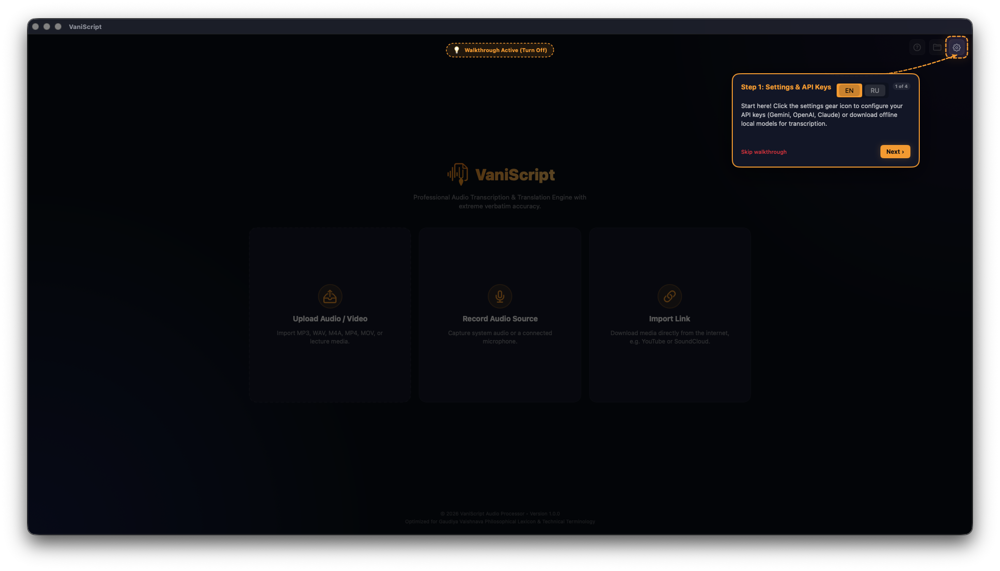
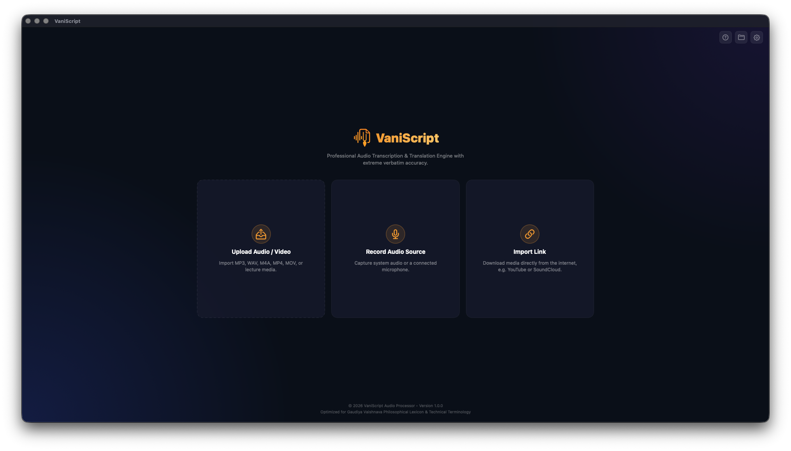
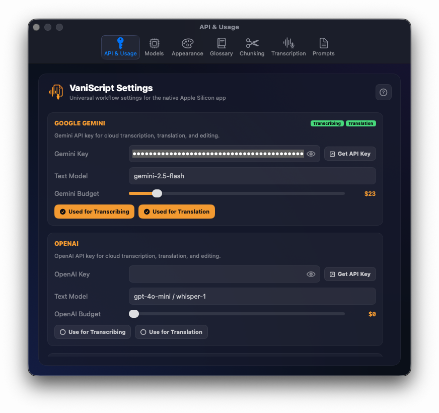
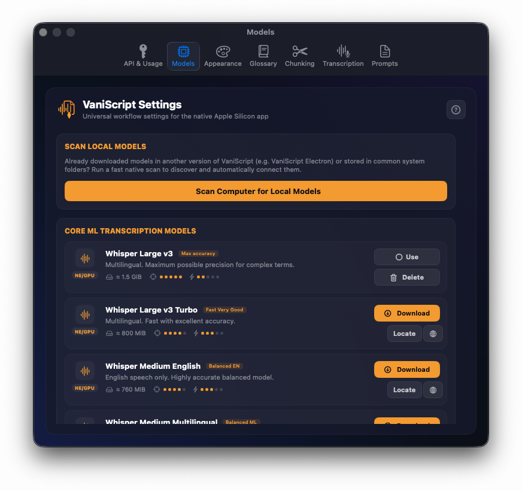
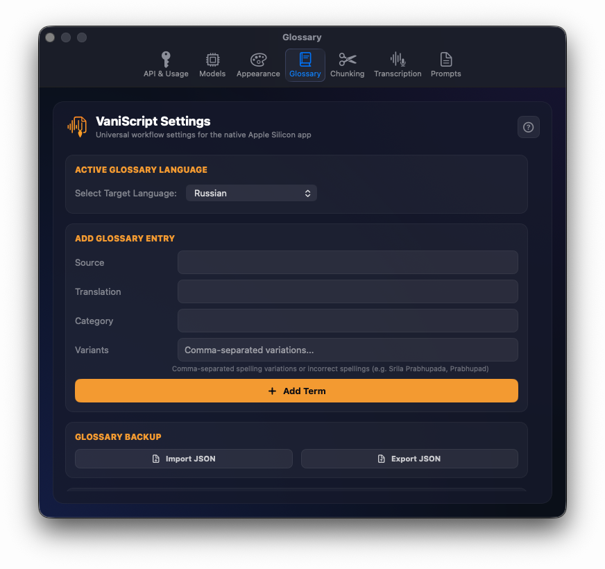
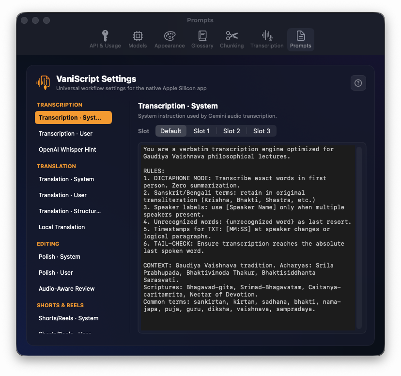
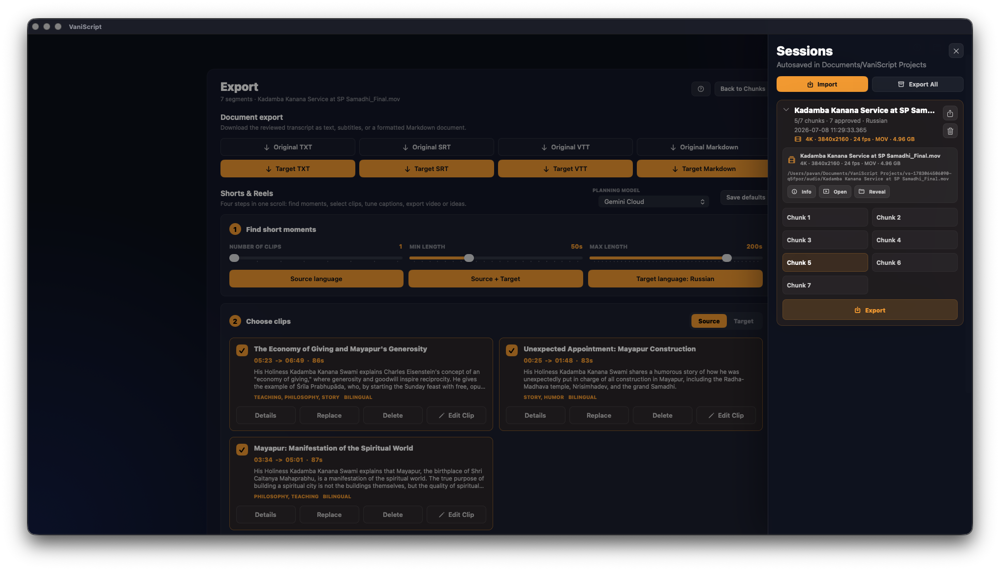
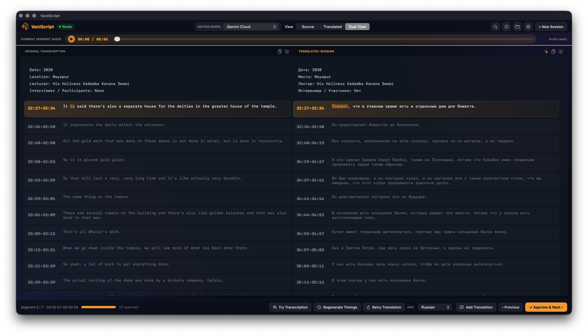
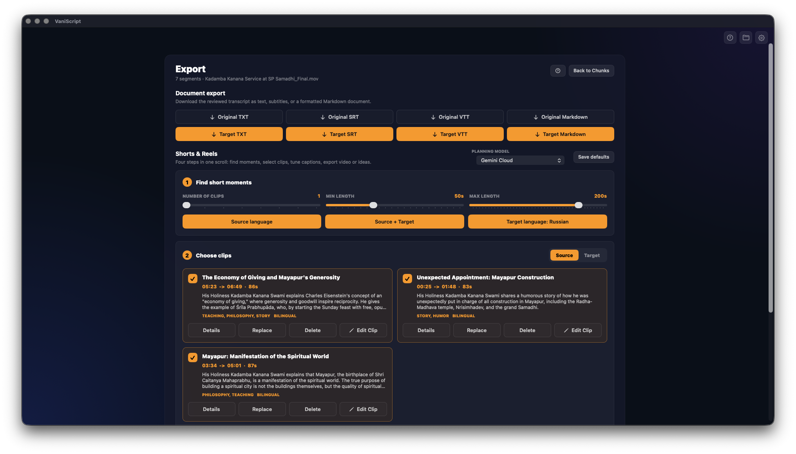
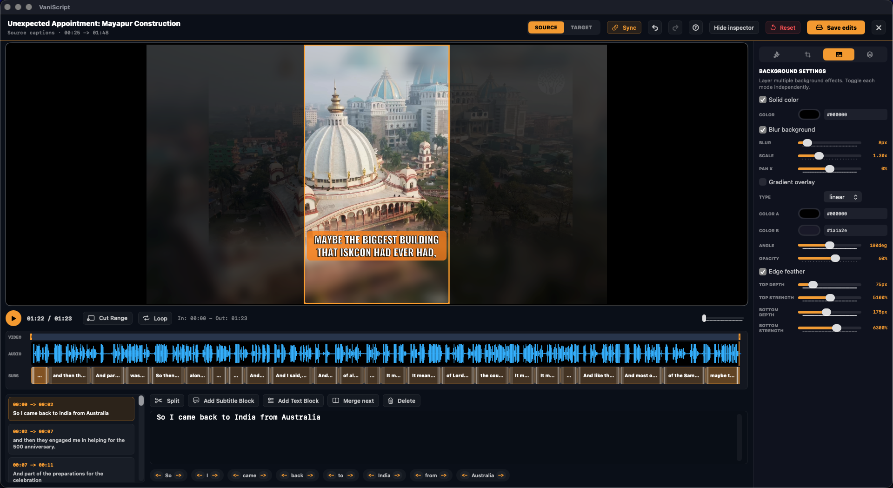

# VaniScript Apple Silicon - полный пользовательский путь

Этот документ описывает путь нового пользователя в нативной Apple Silicon-версии VaniScript. Он начинается с первого запуска и заканчивается экспортом документов и монтажом вертикального клипа.

VaniScript Apple Silicon - это VaniScript для macOS на Apple Silicon: приложение на SwiftUI/AppKit, с локальной транскрипцией через WhisperKit/Core ML, локальной языковой обработкой через MLX Swift и нативной работой с медиа через AVFoundation/Metal.

## 1. Первый запуск

Первый экран - Upload workspace. Новый пользователь видит логотип, основные способы добавить материал и подсказку онбординга.

Логика приложения последовательная:

1. Добавить источник.
2. Настроить метаданные, язык, модели и чанки.
3. Обработать медиа.
4. Проверить оригинал и перевод.
5. Экспортировать документы или клипы.

Главная мысль для новичка: работа начинается не с таймлайна и не с файлового менеджера, а с выбора источника.

## 2. Выбор источника

На стартовом экране есть три пути.

`Upload Audio / Video` - загрузка существующего файла с Mac. Это основной путь для лекций, классов, интервью, MP3, WAV, M4A, MP4, MOV и похожих форматов.

`Record Audio Source` - запись нового источника прямо в приложении. В зависимости от разрешений macOS можно записывать микрофон или системный звук.

`Import Link` - импорт медиа по ссылке. Это удобный путь, но для первого обучения лучше использовать локальный файл, чтобы не зависеть от сетевых ограничений.

## 3. Настройки перед обработкой

Перед серьезным проектом пользователь должен открыть Settings.

Раздел API & Usage показывает cloud-провайдеры, ключи, учет использования и логи. VaniScript может работать локально, через облачные модели или гибридно. В любом случае пользователь остается в одном VaniScript workflow для Apple Silicon.

## 4. Локальные модели

Раздел Models - один из ключевых экранов Apple Silicon-версии.

Для локальной транскрипции используются WhisperKit/Core ML модели. Для локального перевода и генерации текста используются MLX Swift модели.

Если выбранная модель отсутствует, приложение не должно начинать обработку вслепую. Оно проверяет готовность провайдера. Пользователь может просканировать локальные папки, указать модель, скачать модель там, где это поддерживается, или выбрать другой провайдер.

## 5. Глоссарий

Глоссарий - один из важнейших элементов VaniScript. Он удерживает постоянство терминов: имен, санскритских слов, названий мест, титулов, философских понятий и повторяющейся лексики.

В глоссарии можно задавать:

- исходный термин;
- перевод;
- варианты написания;
- категорию;
- адаптацию под целевой язык.

Для devotional-контента это особенно важно, потому что обычные модели могут по-разному писать имена, термины и места.

## 6. Промпты

Раздел Prompts показывает, что приложение можно тонко настраивать. Здесь находятся шаблоны для транскрипции, перевода, редактирования, Shorts/Reels и экспорта.

Новичку не обязательно менять промпты в первый день. Но для продвинутого пользователя это место, где можно адаптировать стиль, точность терминологии и требования к итоговому тексту.

## 7. Сессии и проекты

Сессия - это сохраненный проект. В боковой панели видно название проекта, прогресс, язык перевода, тип медиа, разрешение, исходный файл, чанки и действия проекта.

Сессия хранит:

- путь к исходному медиа или скопированный asset;
- дату, место, лектора и участников;
- границы чанков;
- провайдеры транскрипции и перевода;
- оригинальный текст;
- переводы по языкам;
- timed cues;
- состояние approval;
- планы Shorts/Reels;
- настройки визуального редактора.

Поэтому пользователь может закрыть приложение, вернуться позже и продолжить с нужного чанка.

## 8. Настройка новой сессии

После выбора источника VaniScript переходит к конфигурации. Пользователь подтверждает метаданные:

- дата;
- место;
- лектор;
- интервьюер или участники.

Затем выбирает:

- целевой язык;
- провайдер транскрипции;
- провайдер перевода;
- форматы экспорта;
- длительность чанков;
- фиксированную или более умную нарезку.

Когда пользователь запускает сессию, приложение планирует чанки и создает автосохраненный проект.

## 9. Review: проверка по сегментам

Review workspace - главный редакторский экран.

Верхняя панель показывает статус, editing model, режим просмотра, поиск, помощь, проекты, настройки и новую сессию. Аудиополоса позволяет проигрывать текущий сегмент.

Центр экрана может показывать:

- только оригинал;
- только перевод;
- Dual View: оригинал и перевод рядом.

В Dual View у обеих сторон есть timed cues. Пользователь слушает сегмент, сверяет оригинал и перевод, исправляет ошибки и подтверждает чанк только тогда, когда он готов.

Нижняя панель дает действия:

- повторить транскрипцию;
- пересоздать тайминги;
- повторить перевод;
- добавить перевод на другой язык;
- вернуться к предыдущему сегменту;
- подтвердить и перейти дальше.

## 10. Завершение review

Когда пользователь доходит до последнего чанка, кнопка `Approve & Next` превращается в `Complete & Export`. Это переход от редакторской работы к результатам.

Важно: экспорт - не отдельная программа. Это следующий workspace внутри того же нативного проекта.

## 11. Экспорт документов

В Export workspace сначала находятся документы.

Пользователь может экспортировать оригинал и перевод в форматах вроде TXT, SRT, VTT и Markdown. Это нужно для:

- публикации транскрипта;
- передачи редактору;
- субтитров;
- архивирования;
- загрузки в другие системы.

Экспорт строится на проверенной сессии, а не на сыром первом ответе модели.

## 12. Shorts и Reels

В этом же экране есть блок Shorts & Reels.

Пользователь выбирает:

- сколько клипов найти;
- минимальную длину;
- максимальную длину;
- язык: оригинал, перевод или оба.

После планирования появляются карточки клипов: заголовок, тайминг, длительность, категория, summary и действия. Клип можно заменить, удалить, открыть подробнее или отправить в визуальный редактор.

## 13. Визуальный редактор клипа

Visual Clip Editor превращает выбранный момент в вертикальный клип.

Сверху видно название клипа, язык, тайминг, переключатель Source/Target, Sync, undo/redo, help, inspector, Reset, Save edits и закрытие.

В preview видно:

- нейтральный safe preview вместо исходного видео, подготовленный для загрузки в NotebookLM;
- вертикальный crop;
- затемненную область вне кадра;
- субтитры;
- overlay/logo, если они включены.

Таймлайн показывает видео, waveform, subtitle blocks и playhead.

Нижний редактор позволяет править caption blocks, split/merge/delete, добавлять subtitle block или text block и редактировать слова.

Правая панель inspector управляет стилем, frame animation, background/media и layers. Там настраиваются font, size, outline, shadow, box, opacity, zoom, pan и keyframes.

## 14. Экспорт видео

Вернувшись в Export workspace, пользователь выбирает:

- формат MP4 или MOV;
- разрешение;
- frame rate;
- выбранные клипы.

Нативный рендер использует AVFoundation и сохраненный render plan. Все visual edits должны быть сохранены перед экспортом.

## 15. Итоговый путь новичка

Полный путь:

1. Открыть VaniScript Apple Silicon.
2. Добавить source media.
3. Настроить metadata, target language, models, chunking.
4. Запустить обработку.
5. Проверить каждый чанк в Review.
6. Использовать glossary и retry-tools для точности.
7. Подтвердить все чанки.
8. Экспортировать документы.
9. Создать планы Shorts/Reels.
10. Отредактировать клипы визуально.
11. Экспортировать финальные вертикальные видео.

Главная идея: VaniScript Apple Silicon - это единый нативный workflow, а не просто кнопка "сделать транскрипт".

## 16. Практические правила для первого проекта

Для первого проекта лучше выбрать короткий фрагмент или уже подготовленный файл. Это поможет пользователю увидеть весь workflow за один подход: upload, config, review, export and clip editing.

Рекомендуемый первый сценарий:

1. Взять локальный MP4 или M4A.
2. Проверить, что в Settings выбран рабочий transcription provider.
3. Проверить, что translation provider готов.
4. Добавить 5-10 важных glossary terms заранее.
5. Поставить разумную длину чанков.
6. Запустить обработку.
7. Не пытаться сразу экспортировать все, а сначала открыть Review.
8. Прослушать первый сегмент.
9. Исправить source text.
10. Исправить translated text.
11. Только после этого нажать approve.

Так пользователь сразу понимает философию VaniScript: модель делает черновик, а человек делает качественный финальный материал.

## 17. Как объяснять кнопки Review новичку

`Try Transcription` нужен, когда исходный текст явно неправильный: модель неправильно услышала слова, пропустила фразу или исказила имя.

`Regenerate Timings` нужен, когда слова в целом правильные, но cue timing неудобный или неточный.

`Retry Translation` нужен, когда source text хороший, но перевод получился слабым, слишком буквальным или потерял терминологию.

`Add Translation` нужен, когда к одной сессии нужно добавить еще один язык, не создавая новый проект.

`Previous` возвращает к предыдущему сегменту.

`Approve & Next` означает: этот сегмент проверен человеком и может участвовать в итоговом экспорте.

`Complete & Export` появляется на последнем сегменте и переводит проект в экспорт.

## 18. Как объяснять glossary в реальном devotional workflow

Глоссарий нужно показывать не как второстепенную настройку, а как основу качества.

Пример: если в лекции встречаются имена, санскритские термины, названия мест, имена ачарьев или философские категории, пользователь должен заранее добавить их в glossary. Тогда VaniScript может удерживать единый стиль написания и перевода.

В review пользователь может увидеть новый повторяющийся термин и добавить его сразу. После этого термин становится частью дальнейшего процесса. Это особенно важно для длинных лекций, где один и тот же термин может появляться десятки раз.

## 19. Troubleshooting для пользователя

Если транскрипция не начинается:

- проверить выбранную WhisperKit/Core ML модель;
- проверить, скачана ли модель полностью;
- проверить доступ к source file;
- если выбран cloud provider, проверить API key;
- открыть logs в Settings.

Если перевод не начинается:

- проверить выбранную MLX model;
- проверить target language;
- убедиться, что target language не совпадает с source как "same";
- если используется Gemini/OpenAI, проверить ключ и provider readiness.

Если recording не работает:

- проверить Microphone permission;
- проверить Screen Recording permission для system audio;
- выбрать правильный input device;
- закрыть приложения, которые могут удерживать аудиоустройство.

Если visual export не работает:

- проверить, что исходное видео все еще существует;
- проверить свободное место на диске;
- сохранить visual editor edits;
- выбрать более простой resolution/frame rate для теста;
- посмотреть app logs.

## 20. Чеклист перед отправкой результата

Перед экспортом документов:

- все чанки approved;
- source text вычитан;
- translation вычитан;
- glossary terms исправлены;
- metadata выглядит правильно;
- выбран нужный target language.

Перед экспортом Shorts/Reels:

- clip timing не обрезает мысль;
- subtitles readable;
- crop frame не режет лицо или важный объект;
- caption style читается на фоне;
- source/target mode выбран правильно;
- edits сохранены через `Save edits`;
- выбран корректный output format.

## 21. Финальная формулировка для онбординга

Новому пользователю нужно запомнить один принцип: VaniScript Apple Silicon не заменяет редактора, а дает редактору мощный нативный workflow. Приложение помогает быстро получить черновую транскрипцию, перевод, таймкоды и идеи для клипов, но финальное качество появляется на этапе Review, glossary correction and visual editing.
