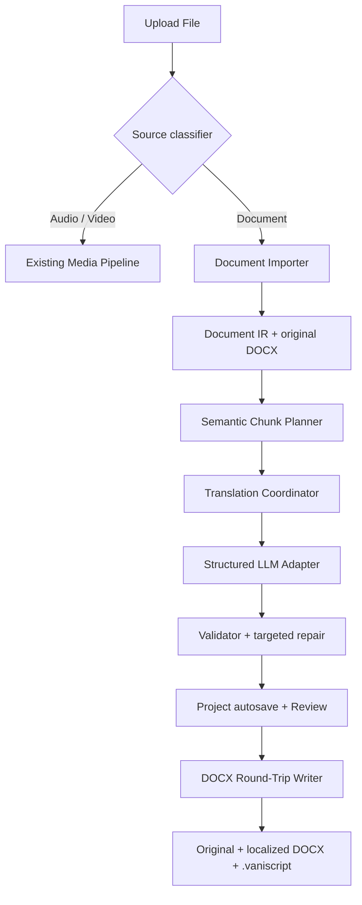

# VaniScript: архитектура литературного перевода документов

**Статус:** архитектурная спецификация для последующей декомпозиции Оркестратором  
**Репозиторий:** `Pavan-Gopa/VaniScript`  
**Проверенная ветка:** `main`  
**Проверенный commit:** `373032ec35bd93ab7274900e7998c83b9651ec40`  
**Дата анализа:** 14 августа 2026  
**Область этого PR:** архитектурный документ; кодовая реализация вынесена в последующие задачи

## 1. Короткий вердикт

VaniScript не нужно превращать во второе отдельное приложение и не нужно переписывать существующий медиапайплайн. Правильное решение — сохранить общую оболочку `upload → config → processing → review → export`, но добавить второй специализированный контур обработки источника:

- существующий **Media Pipeline** продолжает работать с аудио/видео, таймингами, ASR и субтитрами;
- новый **Document Pipeline** работает с семантическими блоками документа, структурным чанкингом, литературным переводом и точной сборкой DOCX.

Переиспользуются навигация, проектная библиотека, провайдеры LLM, глоссарий, двойная панель редактирования, автосохранение и `.vaniscript`-бандл. Не переиспользуются как есть аудиочанкинг, временные диапазоны, транскрибация и экспорт через `TranscriptExportBuilder`.

Ключевой принцип: **для DOCX источником оформления остаётся сам исходный OOXML-пакет**. VaniScript не создаёт «похожий Word-файл» заново, а копирует исходный DOCX и заменяет только разрешённые текстовые узлы. Так сохраняются стили, шрифты, поля, отступы, курсив, колонтитулы, пустые абзацы, цитатные блоки и прочая верстка.

Автоматическое подтверждение не должно означать «принимать любой ответ модели». Оно означает: непрерывно обрабатывать книгу, автоматически подтверждать только структурно валидные чанки, а подозрительные фрагменты помечать `Needs Review` и продолжать очередь.

## 2. Что уже есть в VaniScript и что можно использовать

Текущая кодовая база уже содержит почти всю оболочку будущего продукта:

- `UniversalWorkflow.swift` задаёт подходящий маршрут `upload/config/processing/review/export`.
- `WorkflowStore.swift` управляет проектом, текущим чанком, обработкой, ручным подтверждением, автосохранением и открытием проекта.
- `CloudTextTranslationEngine.swift` и `MLXTextGenerationEngine.swift` дают облачный и локальный LLM-контуры.
- `DefaultPrompts.swift` уже содержит строгий структурированный перевод сегментов, но пока ориентирован на транскрипты.
- `ReviewWorkspaceView.swift` уже имеет исходную и переводную панели, редактирование, поиск/замену, глоссарий и повторный перевод.
- `ProjectArchive.swift`, `ProjectBundleExporter.swift` и `ProjectBundleImporter.swift` уже создают переносимый `.vaniscript`-проект с вложенными ассетами.
- `ProjectDiskStore.swift` сохраняет проектную библиотеку.

Однако текущие базовые допущения медиаспецифичны:

- `WorkflowState.canStartSession` требует провайдер транскрибации;
- `WorkflowState.startSession()` всегда вызывает временной `ChunkPlanner`;
- `ChunkData` адресует источник через `startSec/endSec`;
- `NativeProcessingPipeline` экспортирует аудиочанк и запускает ASR;
- `TranscriptExportBuilder` создаёт TXT/Markdown/SRT/VTT и добавляет тайминги;
- `CloudTextTranslationEngine.translateCues()` режет источник пакетами по 2 200 символов, локальный путь — по 1 400 символов;
- текущий fallback структурированного cue-парсера способен подставить исходный текст при отсутствующем ID. Для книжного автоматического режима это недопустимо: пропущенный перевод должен быть ошибкой, а не «успешным» чанком.

Следовательно, расширять нужно прежде всего доменную модель источника и процессор, а не переписывать интерфейс целиком.

## 3. Результаты анализа первой книги

Файл: `KF_Voyage_2026_English_manuscript_for_translators.docx`.

### 3.1. Объём

- 56 страниц по метаданным Word;
- 25 763 слова по метаданным Word, 25 705 слов при независимом извлечении;
- 872 абзаца, из них 635 непустых;
- около 149 тысяч извлечённых текстовых символов;
- одна секция документа;
- формат страницы A4, поля примерно по 1 дюйму.

### 3.2. Структура

- 21 абзац стиля `Chapter titles`, включая содержание, редакторское предисловие, 16 нумерованных глав, эпилог и заключительные разделы;
- 267 абзацев `Body Text`;
- 32 блока `Quotes`;
- 26 специальных блоков `Headings`;
- 10 блоков `Book titles`;
- нет таблиц, изображений, сносок, концевых сносок, комментариев и отслеживаемых исправлений;
- нет явных разрывов страниц: страницы формируются автоматической версткой Word;
- отдельные абзацы переходят через границу страницы.

### 3.3. Типографика

- основной стиль ссылается на `Brill-Roman`;
- большинство явных текстовых прогонов и специальные стили используют `Gentium`;
- шрифты в DOCX не встроены;
- присутствует значимое форматирование курсивом: названия книг, санскритские термины, транслитерация и шлоки;
- используются диакритические знаки: `Kṛṣṇa`, `Vṛndāvana`, `Bhagavad-gītā`, `Śrīla Prabhupāda` и другие.

### 3.4. Вывод для чанкинга

Резать эту рукопись по страницам или фиксированным символам нельзя. Надёжные границы уже присутствуют в документе:

- `Chapter titles` — жёсткие границы крупных разделов;
- `Body Text` — атомарные смысловые абзацы;
- `Quotes` — цитаты и переводы шлок;
- последовательности курсивных строк — шлоки/стихи;
- `Headings` — подзаголовки и специальные поэтические конструкции;
- пустые абзацы — типографические разделители, которые нужно сохранить, но не отправлять модели как переводимый текст.

При облачном профиле примерно по 1 200–1 700 исходных слов на рабочий чанк книга даст ориентировочно 24–30 чанков. Точное число определяется токенизатором выбранной модели и группировкой шлок. При нынешнем локальном лимите MLX в 2 048 выходных токенов потребуется значительно больше мелких чанков, поэтому размер нельзя хранить одним глобальным числом символов.

## 4. Цели и границы первой версии

### 4.1. Обязательные цели

1. Принимать документы через первую карточку текущего окна загрузки.
2. Для первой производственной версии качественно поддержать DOCX.
3. Импортировать весь структурный текст и сохранить исходный DOCX без изменений.
4. Планировать чанки по структуре и токен-бюджету, не разрывая обычные абзацы, цитаты и шлоки.
5. Переводить литературно, но без сокращения, пересказа, добавления мыслей и изменения авторской позиции.
6. Сохранять прямую речь, первое лицо, риторические вопросы, повторы, юмор и интонацию Гуру Махараджа.
7. Возвращать строго структурированный ответ с теми же ID блоков.
8. Проверять полноту и целостность ответа до принятия.
9. Поддерживать ручной и непрерывный автоматический режимы.
10. Автосохранять каждый успешно обработанный чанк и возобновлять работу после перезапуска.
11. Экспортировать локализованный DOCX на основе исходного OOXML.
12. При пакетном экспорте сохранять в выбранную папку исходник, локализованный DOCX и самодостаточный `.vaniscript`-проект.
13. Извлекать список требуемых документом шрифтов, сверять его с системным каталогом macOS и давать пользователю явный выбор шрифтов/замен до обработки и экспорта.
14. При открытии `.vaniscript` восстанавливать исходник, структурированный перевод, типографический профиль и готовый локализованный DOCX.
15. Не ломать существующие аудио/видео-проекты и старые проектные бандлы.

### 4.2. Не обещать в первой версии

- идентичное количество страниц после перевода;
- пиксельное совпадение строк и переносов на другой язык;
- точное восстановление оформления из произвольного PDF;
- безопасное открытие `.docm` с макросами;
- перевод сканированного PDF без отдельного OCR-контура;
- автоматическое решение богословской политики для каждой шлоки без пользовательского профиля.

Стили, шрифты, поля, абзацные роли и все нетекстовые элементы DOCX можно сохранить. Но русский, чешский или другой язык меняет длину строк, поэтому пагинация неизбежно может сдвинуться. Полное совпадение страниц — задача финальной ручной верстки, а не перевода.

## 5. Целевая архитектура



### 5.1. Главная граница модулей

```swift
enum WorkflowSourceKind: String, Codable, Sendable {
    case media
    case document
}

protocol SourceProcessingPipeline: Sendable {
    func prepare(session: SessionState, settings: AppSettings) async throws -> SessionState
    func processNext(session: SessionState, settings: AppSettings) async -> ProcessingOutcome
}
```

Не следует пытаться превратить аудиотайминг и диапазон абзацев в один универсальный `Double`. Общим остаётся жизненный цикл, но локатор источника типизирован:

```swift
enum SourceAnchor: Codable, Equatable, Sendable {
    case media(startSec: Double, endSec: Double)
    case document(DocumentRange)
}
```

Для мягкой миграции старые `startSec/endSec` остаются в `ChunkData`, а `sourceAnchor` добавляется как optional. Старый проект без нового поля декодируется как `.media`.

## 6. Промежуточное представление документа

### 6.1. Почему нельзя хранить только одну строку на чанк

Для редактора одной строки достаточно, но для точной сборки DOCX необходимо знать, какой перевод относится к какому абзацу, прогону форматирования и OOXML-узлу. Поэтому `chunk.original/translated` могут остаться совместимым кэшем для текущего UI, но источником истины должен стать `DocumentState`.

### 6.2. Предлагаемые контракты

```swift
struct DocumentState: Codable, Equatable, Sendable {
    var format: DocumentFormat
    var originalAsset: ProjectAssetReference
    var metadata: DocumentMetadata
    var blocks: [DocumentBlock]
    var chunks: [DocumentChunkPlan]
    var translationsByLanguage: [String: [String: TranslatedBlock]]
    var outputs: [DocumentOutputAsset]
    var profile: DocumentTranslationProfile
}

struct DocumentBlock: Codable, Equatable, Identifiable, Sendable {
    var id: String
    var location: DocumentLocation
    var kind: DocumentBlockKind
    var styleID: String?
    var paragraphPropertiesFingerprint: String
    var spans: [RichTextSpan]
    var sourceHash: String
    var translationPolicy: BlockTranslationPolicy
}

struct RichTextSpan: Codable, Equatable, Sendable {
    var id: String
    var text: String
    var styleKey: String
    var traits: Set<InlineTrait>
    var translationPolicy: SpanTranslationPolicy
}

struct DocumentLocation: Codable, Equatable, Sendable {
    var part: DocumentPart
    var paragraphOrdinal: Int
    var tablePath: [Int]?
    var xmlPath: String
}

struct DocumentChunkPlan: Codable, Equatable, Identifiable, Sendable {
    var id: String
    var blockIDs: [String]
    var sourceTokenEstimate: Int
    var contextBeforeBlockIDs: [String]
    var contextAfterBlockIDs: [String]
    var sourceHash: String
}
```

`DocumentPart` должен предусматривать не только main body, но и headers, footers, footnotes, endnotes и text boxes. В первой книге фактически нужен только main body, но контракт не должен заставить мигрировать проекты при первом же более сложном DOCX.

### 6.3. Стабильные ID

ID нельзя строить только из порядкового номера: после будущего ручного редактирования исходника номер может сдвинуться. Рекомендуемый ID:

`<part>:<paragraphOrdinal>:<normalizedSourceHashPrefix>`

Перед экспортом writer проверяет и location, и `sourceHash`. Если исходный OOXML больше не соответствует проекту, экспорт завершается явной ошибкой, а не заменяет случайный соседний абзац.

## 7. Импорт документов

### 7.1. Поддержка форматов по уровням точности

| Уровень | Форматы | Гарантия |
|---|---|---|
| A — round-trip | DOCX | Сохранение исходного пакета и хирургическая замена текста |
| B — структурный импорт | RTF, ODT, HTML, Markdown | Сохранение смысловой структуры с возможной нормализацией оформления |
| C — восстановление | PDF с текстовым слоем | Эвристическая реконструкция абзацев и заголовков |
| D — OCR | сканированный PDF/изображения | Отдельный последующий этап через Vision |
| Plain | TXT | Абзацы и пустые строки без богатого оформления |

Пользовательская формулировка «что угодно ещё» реализуется как расширяемый registry импортёров, но интерфейс обязан честно показывать уровень точности конкретного формата. Для первой книги и первого релиза приоритет — DOCX.

### 7.2. DOCXImporter

`DOCXImporter` должен:

1. Скопировать исходный файл в внутреннюю папку проекта; никогда не изменять пользовательский файл на месте.
2. Безопасно открыть ZIP/OOXML-пакет.
3. Прочитать `word/document.xml`, `styles.xml`, `numbering.xml`, `fontTable.xml`, relationships и при наличии headers/footers/footnotes/endnotes.
4. Обойти `w:p`, включая абзацы в таблицах и text boxes.
5. Сохранить `w:pPr` как неизменяемую структуру/отпечаток.
6. Объединить случайные соседние Word-runs с одинаковым визуальным стилем, но сохранить значимые границы: italic, bold, small caps, superscript/subscript, hyperlink, language, protected term.
7. Исключить из перевода field instructions, bookmarks, drawing data и служебные XML-узлы.
8. Нормализовать рабочий текст в Unicode NFC без удаления диакритики.
9. Создать `DocumentState`, статистику и предварительный план чанков.
10. Сохранить SHA-256 исходного DOCX.

На macOS `NSAttributedString.DocumentType.officeOpenXML` можно использовать как дополнительный fallback и для предпросмотра, но не как основной round-trip writer: повторный экспорт attributed string не гарантирует сохранение всех исходных OOXML-частей.

Для чтения и пересборки ZIP-пакета подходит Swift-библиотека ZIPFoundation: она не требует внешнего исполняемого runtime и умеет читать/создавать/изменять ZIP на Apple-платформах.

### 7.3. Безопасность импорта

- запрет `../` и абсолютных путей в ZIP entries;
- лимит числа entries и общего распакованного размера;
- запрет сетевой загрузки external relationships;
- XML-парсер без внешних сущностей;
- отказ от `.docm` в первой версии;
- отдельные лимиты на размер PDF и количество страниц OCR;
- импорт в уникальную временную папку с последующим атомарным переносом.

## 8. Семантический чанкинг

### 8.1. Основной принцип

Чанк — не кусок строки фиксированной длины, а последовательность **атомарных смысловых групп**, упакованная в токен-бюджет модели.

### 8.2. Этапы планировщика

1. **Классификация блоков.** Использовать style ID, outline level, paragraph properties, пустые интервалы, соседство и содержимое.
2. **Защита специальных фрагментов.** Отметить шлоки, мантры, транслитерацию, имена, номера стихов и неизменяемые маркеры.
3. **Построение атомарных групп.** Связать элементы, которые нельзя разрывать.
4. **Расчёт бюджета.** Использовать реальный tokenizer локальной модели или provider-specific estimator для облака.
5. **Упаковка внутри раздела.** Не переходить границу главы без необходимости.
6. **Добавление контекста.** Передать соседние блоки как read-only context, не ожидая их в ответе.
7. **Стабильное хэширование.** Hash чанка включает source blocks, профиль, глоссарий, модель и версию промпта.

### 8.3. Правила границ для первой книги

- `Chapter titles` — жёсткая граница; заголовок прикрепляется к первому текстовому блоку главы.
- `Body Text` — неделимый блок, если один абзац не превышает hard limit.
- соседние `Quotes` — одна цитатная группа;
- вводная фраза о шлоке + строки шлоки + существующий прозаический перевод + ссылка на источник — одна атомарная группа;
- последовательные `Headings` в главе 15/16 группируются, а не считаются отдельными главами;
- `Book titles` сохраняют курсивную роль;
- пустые абзацы входят в карту вывода, но не расходуют LLM-бюджет;
- при экстремально длинном абзаце fallback режет только по предложениям, сохраняя кавычки и скобки сбалансированными.

### 8.4. Токен-бюджет

Нужен `TranslationBudgetPlanner`, а не один `maxSourceCharacters`:

```text
usableContext = modelContextWindow
              - systemAndSchemaTokens
              - glossaryTokens
              - rollingContextTokens
              - reservedOutputTokens
              - safetyMargin
```

`reservedOutputTokens` рассчитывается из исходных токенов и коэффициента расширения целевого языка. Планировщик должен знать реальные capability выбранного провайдера: context window, max output, structured output и tokenizer/estimator.

Рекомендуемый облачный профиль для этой рукописи:

- soft target: примерно 1 200–1 500 английских слов;
- hard limit: примерно 1 700–1 900 слов при достаточном окне модели;
- previous context: 1–2 исходных абзаца и их уже принятый перевод;
- next context: следующий заголовок или один следующий абзац;
- не переводить контекст повторно.

Точные числа вычисляются по токенам. Настройка в UI может называться `Balanced / More context / Smaller chunks`, чтобы не заставлять обычного пользователя думать в токенах.

### 8.5. Почему обработка книги должна быть последовательной

Параллельный перевод нескольких глав ускоряет работу, но ухудшает последовательность терминологии, голоса и решений по именам. Для литературного режима по умолчанию нужен последовательный coordinator с rolling memory. Параллельность допустима позже как отдельный быстрый профиль с предупреждением.

## 9. Профиль перевода

```swift
struct DocumentTranslationProfile: Codable, Equatable, Sendable {
    var sourceLanguage: String
    var targetLanguage: String
    var mode: LiteraryTranslationMode
    var voice: VoicePreservationPolicy
    var sanskritPolicy: SanskritPolicy
    var protectedTerms: [ProtectedTerm]
    var projectGlossary: [GlossaryEntry]
    var translatorNotes: String
}
```

### 9.1. Режим для этой книги

Рекомендуемый default: `faithfulLiterary`.

- перевод литературный и естественный для носителя;
- смысловая структура, порядок аргументов и фактические детали сохраняются;
- первое лицо не заменяется безличным изложением;
- риторические вопросы, повторы и юмористические развороты сохраняются;
- модель не «улучшает учение», не добавляет пояснений и не смягчает формулировки;
- прямые высказывания Гуру Махараджа переводятся максимально близко, но без неестественных кальк;
- редакторские вставки модели запрещены.

Не следует сначала делать буквальный перевод, а затем прогонять весь текст через свободный `literaryPolish`: второй широкий проход снова создаёт риск пересказа. Литературность должна быть частью основного строгого перевода. Дополнительный repair применяется только к блоку, который не прошёл проверку или был выбран редактором.

### 9.2. Политика санскрита

Архитектура должна поддерживать три режима:

1. `preserveExact` — шлока/мантра копируется байт-в-байт и не отправляется как переводимый content;
2. `preserveTransliterationTranslateGloss` — транслитерация неизменна, существующий прозаический перевод переводится;
3. `editorApprovedAdaptation` — допускается отдельная адаптация выбранного блока только после явного решения редактора.

Для первого запуска рекомендуется режим 2:

- строки санскритской/бенгальской транслитерации остаются неизменными;
- английский перевод шлоки переводится на целевой язык;
- номера стихов и названия источников сохраняются;
- богословские термины проходят через проектный глоссарий;
- сомнительный автоматически распознанный блок показывается в preflight и может быть вручную переключён между `Protect` и `Translate`.

Автоматический Sanskrit detector не должен единолично решать вопрос: курсивом в книге выделены и обычные названия. Детектор предлагает классификацию, пользователь подтверждает спорные группы до запуска.

## 10. Строгий LLM-контракт

### 10.1. Отдельные prompt IDs

Не менять существующие transcript prompts. Добавить отдельные определения:

- `documentLiteraryTranslationSystem`;
- `documentLiteraryTranslationUser`;
- `documentTranslationRepair`;
- `documentTranslationQualityReview` — опционально, возвращает замечания, а не переписывает текст;
- `documentVerseClassification` — только для спорных блоков preflight.

Так аудиорегрессии не смешиваются с книжным режимом.

### 10.2. Формат запроса и ответа

Модель получает:

- краткий профиль книги и голоса;
- целевой язык;
- обязательный глоссарий;
- список protected tokens;
- read-only context before/after;
- переводимые блоки с ID, ролью и безопасной inline-разметкой.

Ответ — строгий JSON:

```json
{
  "schema": "vaniscript.document.translation.v1",
  "chunkId": "chapter-02-part-01",
  "blocks": [
    {
      "id": "main:87:4c20b6ab",
      "spans": [
        {"style": "plain", "text": "..."},
        {"style": "italic-1", "text": "..."}
      ]
    }
  ]
}
```

Inline style IDs — не произвольные CSS-стили, а ссылки на captured run-property templates из исходного абзаца. Модель может переставить размеченную фразу в естественное место целевого предложения, но не может создавать неизвестные style IDs.

Если провайдер поддерживает structured output/JSON schema, adapter обязан использовать его. Для fallback-провайдера JSON всё равно валидируется локально.

### 10.3. Запрет пересказа

System contract должен явно требовать:

- ровно один выходной блок на каждый входной переводимый ID;
- тот же порядок ID;
- никаких объединений и удалений абзацев;
- никаких резюме, пояснений, примечаний, заголовков от модели и markdown fences;
- сохранение чисел, ссылок, цитат, имён и защищённых токенов;
- отсутствие перевода read-only context;
- отсутствие исходного текста в ответе, кроме protected spans;
- сохранение авторской модальности, лица и смысловых повторов.

## 11. Валидатор и targeted repair

Авто-апрув разрешён только после локальной проверки.

### 11.1. Детерминированные проверки

1. JSON/schema валиден.
2. `chunkId` совпадает.
3. Все ожидаемые block IDs присутствуют ровно один раз и в правильном порядке.
4. Нет лишних ID.
5. Все style IDs известны, tags/spans сбалансированы.
6. Protected blocks и protected spans совпадают с оригиналом точно.
7. Числа, годы, номера глав/стихов и placeholders сохранены.
8. Нет пустых блоков.
9. Нет модельных префиксов вроде `Translation:` или объяснений.
10. Нет подозрительного дублирования одного абзаца в нескольких ID.
11. Коэффициент сжатия/расширения не выходит за мягкие пороги без предупреждения.
12. Не осталось большого объёма исходного языка вне allowlist терминов.
13. Unicode проходит NFC и сохраняет диакритику protected terms.

Длина — только сигнал, а не доказательство качества. Короткий русский перевод может быть корректнее длинного английского, поэтому ratio создаёт warning или repair request, а не самовольное изменение текста.

### 11.2. Repair

При ошибке coordinator не перегенерирует всю главу. Он отправляет только невалидные block IDs, их источник, предыдущую кандидатуру и конкретный список нарушений. После двух неудачных repair attempts блок получает `Needs Review`, а очередь продолжает следующую работу.

Семантическая LLM-проверка может добавляться как второй уровень, но она возвращает `issues[]`, а не новый перевод. Любая автоматическая замена снова должна пройти тот же детерминированный валидатор.

## 12. Состояния и авто-апрув

### 12.1. Настройки

Добавить:

```swift
enum ApprovalMode: String, Codable, Sendable {
    case manual
    case automatic
}
```

- `AppSettings.documentApprovalModeDefault` — глобальный default;
- `SessionState.approvalMode` — снимок настройки для конкретного проекта;
- toggle на document config screen — override перед запуском.

Изменение глобальной настройки не должно незаметно менять уже запущенную книгу.

### 12.2. Состояния чанка

Текущего `pending/processing/done/error + approved Bool` недостаточно для аудита. Добавить optional-поля с backward-compatible decoding:

```swift
enum ReviewDisposition: String, Codable, Sendable {
    case pending
    case autoApproved
    case manuallyApproved
    case needsReview
    case failed
}

struct ChunkQualityReport: Codable, Equatable, Sendable {
    var validatorVersion: Int
    var errors: [QualityIssue]
    var warnings: [QualityIssue]
    var attempts: Int
    var sourceHash: String
    var outputHash: String?
}
```

Старое `approved` остаётся вычислимым/синхронизированным для существующего UI и миграции.

### 12.3. Очередь

`DocumentTranslationCoordinator` как actor:

1. берёт следующий pending/needs-retry чанк;
2. собирает translation memory;
3. вызывает adapter;
4. валидирует;
5. при необходимости выполняет targeted repair;
6. записывает block translations;
7. атомарно сохраняет проект;
8. в automatic mode выставляет `autoApproved` при отсутствии blocking errors;
9. при `Needs Review` сохраняет проблему и продолжает очередь;
10. обновляет rolling memory только подтверждёнными результатами;
11. поддерживает pause, resume и cancel;
12. на retryable API error использует exponential backoff с ограничением попыток.

После краша чанк со статусом `processing` при открытии нормализуется в `pendingRetry`. Hash запроса позволяет не тратить повторно API, если валидный ответ уже был записан, но UI ещё не успел обновиться.

## 13. Translation memory и последовательность голоса

`DocumentTranslationMemory` хранит не всю книгу в каждом запросе, а компактное состояние:

- snapshot глобального и проектного глоссария;
- protected names/terms;
- правила голоса;
- последние 1–2 подтверждённых source/target блока;
- решения по неоднозначным терминам;
- chapter title и краткий chapter context;
- model/prompt version.

Memory должна быть видимой и редактируемой в проекте. Нельзя позволять модели скрыто создавать новые «правила перевода», которые редактор не может проверить.

## 14. Точный DOCX round-trip

### 14.1. Writer

`DOCXRoundTripWriter` выполняет следующие действия:

1. Копирует исходный DOCX во временный файл.
2. Открывает копию как OOXML ZIP.
3. Для каждого переводимого `DocumentBlock` находит исходный `w:p` по part/location/hash.
4. Сохраняет `w:pPr` и все нетекстовые дочерние элементы.
5. Для однообразного абзаца создаёт переведённый `w:r` с копией исходного `w:rPr`.
6. Для смешанного форматирования создаёт runs по возвращённым style IDs и копирует соответствующие исходные `w:rPr` templates.
7. Защищённые runs переносит без изменений.
8. Сохраняет bookmarks, fields, tabs, breaks, drawings и relationships.
9. Заменяет только изменённые XML parts и пересобирает ZIP атомарно.
10. Проверяет итоговый пакет до выдачи пользователю.

### 14.2. Инварианты результата

- число структурных абзацев и их порядок совпадают;
- `w:pPr` каждого исходного абзаца сохранён;
- style IDs сохранены;
- `styles.xml`, `fontTable.xml`, theme, numbering, media и relationships не меняются без необходимости;
- все protected blocks совпадают;
- все переводимые block IDs имеют результат;
- исходный файл остаётся byte-identical;
- локализованный файл открывается как корректный DOCX;
- ссылки на `Brill-Roman` и `Gentium` сохраняются.

### 14.3. Системные шрифты, выбор и замены

В первой книге используются `Brill-Roman` и `Gentium`; оба шрифта указаны в OOXML, но не встроены в DOCX. Важно разделить две вещи:

- наличие шрифта в системе позволяет VaniScript и Word корректно отрисовать документ;
- выбор шрифта определяет, какие ссылки будут сохранены или намеренно заменены в локализованном DOCX.

Установка шрифта не должна быть скрытым требованием. После импорта VaniScript извлекает все `w:rFonts` (`ascii`, `hAnsi`, `eastAsia`, `cs`) из runs и стилей, строит список требований и немедленно сверяет его с системным каталогом macOS.

#### 14.3.1. Модель типографики

В `VaniScriptCore` добавить сериализуемые модели без зависимости от AppKit:

```swift
enum DocumentFontPolicy: String, Codable {
    case preserveDocumentFonts
    case replaceMissingFonts
    case overrideTranslatedText
}

enum FontResolutionStatus: String, Codable {
    case installedExact
    case installedAlias
    case missing
    case selectedReplacement
}

struct DocumentFontMapping: Codable, Hashable {
    var sourceFontName: String
    var replacementPostScriptName: String?
    var applyToTranslatedRunsOnly: Bool
}

struct DocumentTypographyProfile: Codable {
    var policy: DocumentFontPolicy
    var mappings: [DocumentFontMapping]
}
```

`DocumentFontRequirement` дополнительно хранит исходное имя, атрибут/роль, список style IDs, число использований и текущий resolution status. В проекте сохраняются имена и выбор пользователя, но не `NSFont` и не бинарные файлы шрифтов.

#### 14.3.2. Системный каталог и resolver

App-layer сервис `SystemFontCatalog` перечисляет установленные family/face/PostScript names через Core Text, а `DocumentFontResolver` сопоставляет ссылки DOCX в следующем порядке:

1. точный PostScript name;
2. точное family + face/traits;
3. нормализованный alias без различий регистра, пробелов и дефисов;
4. явно выбранная пользователем замена;
5. статус `missing`, без молчаливой подмены.

Каталог перечитывается при запуске приложения, после импорта документа, по кнопке `Refresh Fonts` и при возвращении приложения в foreground. Для каждого выбранного шрифта resolver отдельно проверяет наличие глифов для символов проекта, включая `ṛ`, `ṣ`, `ā`, `ī`, `ū`, `ṅ`, `ñ`, `ṭ`, `ḍ`, `ṇ`, `ś` и другие диакритические знаки. Установленный шрифт без нужных глифов считается несовместимым и получает предупреждение.

#### 14.3.3. UI выбора

В document-mode `ConfigWorkspaceView` появляется секция `Document Fonts`:

- строка на каждый требуемый шрифт: `Brill-Roman — Installed` / `Gentium — Missing`;
- количество использований и роли, например body, quote, Sanskrit/verse;
- searchable picker со всеми установленными системными шрифтами и их начертаниями;
- мини-предпросмотр обычного текста и строки `Kṛṣṇa · Vṛndāvana · Śrīla Prabhupāda`;
- выбор политики `Preserve original`, `Replace missing only`, `Use selected font for translated text`;
- действия `Refresh Fonts` и `Open Font Book`;
- предупреждение, если выбранный шрифт исчез после повторного открытия проекта.

По умолчанию действует `Preserve original`: если Brill и Gentium установлены, дополнительных действий от пользователя не требуется. Если шрифт отсутствует, VaniScript не блокирует семантический перевод, но не показывает статус `Layout verified` и требует либо выбрать замену, либо явно продолжить с сохранением исходной ссылки.

В `SettingsView` можно хранить глобальные предпочтения/fallback mappings, однако выбор внутри проекта всегда имеет приоритет. Это позволяет один раз сопоставить, например, отсутствующий `Brill-Roman`, но не навязывать замену другой книге.

#### 14.3.4. Writer, экспорт и лицензии

- `preserveDocumentFonts`: `fontTable.xml`, styles и `w:rFonts` остаются без изменений;
- `replaceMissingFonts`: writer меняет только разрешённые ссылки согласно mapping и фиксирует изменение в quality report;
- `overrideTranslatedText`: выбранный шрифт применяется только к переведённым runs; protected Sanskrit/runs сохраняют исходную типографику, если пользователь отдельно не изменил их mapping;
- исходный DOCX всегда остаётся byte-identical;
- `.vaniscript` сохраняет typography profile и повторно проверяет доступность шрифтов при открытии на другой машине;
- export screen показывает таблицу `Required / Selected / Installed / Glyph coverage`.

VaniScript не должен автоматически скачивать, встраивать или распространять Brill, Gentium либо любые другие font files без проверки лицензии. Отсутствие embedded fonts — предупреждение, а не повод тихо заменить гарнитуру системным default.

### 14.4. Содержание и пагинация

Если DOCX использует настоящее TOC field, writer сохраняет поле и может выставить `updateFieldsOnOpen`. Если содержание набрано обычным текстом, как в предоставленной рукописи, номера страниц после перевода могут устареть. Экспортный QA должен пометить такой блок для финальной верстки.

## 15. Проектный файл и пакетный экспорт

### 15.1. Источник истины

Источник истины — `DocumentState` внутри проекта. Локализованный DOCX — производный артефакт. Это позволяет редактору править отдельные блоки в VaniScript и в любой момент безопасно пересобрать Word-файл.

### 15.2. Новая схема `.vaniscript`

Повысить bundle schema с 3 до 4 и добавить typed asset manifest:

```swift
enum ProjectAssetRole: String, Codable {
    case originalSource
    case localizedDocument
    case mediaChunk
    case auxiliary
}

struct ProjectAssetManifestEntry: Codable {
    var key: String
    var role: ProjectAssetRole
    var language: String?
    var format: String
    var originalFileName: String
    var sha256: String
    var size: Int64
}
```

Importer должен понимать v1/v2/v3 как сейчас и v4 через явный migrator. Нельзя просто прочитать `schemaVersion` и проигнорировать его.

Для документа не нужно писать один и тот же исходник как `chunk:0`, `chunk:1` и так далее. Assets дедуплицируются по role + hash; текст чанков уже находится в metadata.

### 15.3. Экспорт в выбранную папку

Добавить действие `Export Translation Package`. Пользователь выбирает директорию, после чего VaniScript атомарно создаёт подпапку:

```text
Voyage_to_Transcendence_Russian/
├── KF_Voyage_2026_English_manuscript_for_translators.docx
├── KF_Voyage_2026_Russian.docx
└── KF_Voyage_2026_Russian.vaniscript
```

Требования:

- первый файл — точная копия исходника;
- второй — текущий локализованный DOCX;
- третий — самодостаточный проект, содержащий исходник, структурированные блоки, переводы, quality reports и актуальный локализованный DOCX;
- запись происходит во временную папку, затем выполняется atomic move;
- коллизия имён обрабатывается через `Replace / Create numbered copy / Cancel`;
- проект не ссылается только на внешнюю выбранную папку.

### 15.4. Открытие проекта

При импорте `.vaniscript`:

1. ассеты извлекаются во внутреннюю папку проекта;
2. пути original/localized remap-ятся;
3. `DocumentState` загружается без повторного парсинга и без повторного перевода;
4. review открывает исходные и целевые блоки;
5. если локализованный DOCX отсутствует или устарел относительно output hash, он пересобирается из исходника и block translations;
6. пользователь продолжает редактирование с последнего чанка или открывает список `Needs Review`.

## 16. Изменения UI

### 16.1. Upload

Первая карточка:

- название: `Upload File` или `Upload Media / Document`;
- описание: `Audio, video, DOCX, PDF, RTF, Markdown, or text`;
- `NSOpenPanel` принимает media и document UTTypes;
- добавить настоящий drag-and-drop через `.dropDestination(for: URL.self)`;
- после выбора `SourceClassifier` направляет файл в media или document importer.

Остальные две карточки — запись и ссылка — остаются без изменений.

### 16.2. Config

Экран условный по `sourceKind`.

Для документа скрыть:

- Audio Metadata;
- Transcription Model;
- Chunk Duration в минутах;
- Slice Mode.

Показать:

- название/автор/исходный язык;
- target language;
- Translation Model;
- литературный профиль;
- Sanskrit & Verse Policy;
- Auto-approve toggle;
- preset чанкинга;
- секцию `Document Fonts` с системными picker-ами, статусами installed/missing, glyph coverage и project-level mappings;
- итог preflight: страницы, слова, разделы, блоки, прогноз чанков, защищённые группы и типографические предупреждения;
- кнопку `Preview Boundaries` для выборочной проверки первых чанков.

### 16.3. Processing

- общий прогресс по чанкам и блокам;
- текущая глава и диапазон абзацев вместо тайминга;
- pause/resume/cancel;
- API retry status;
- счётчик `auto-approved / needs review / failed`;
- автосохранение после каждого чанка.

### 16.4. Review

Переиспользовать dual-pane, но в document mode:

- скрыть audio bar, waveform и timecode;
- вместо `Segment 4 · 00:30–00:40` показывать `Chapter 2 · paragraphs 18–29`;
- отображать блоки с визуальными ролями: heading, body, quote, verse;
- protected verse показывать как locked/read-only;
- редактировать перевод по абзацу/блоку;
- `Retranslate Block`, `Repair`, `Approve`, `Needs Review`;
- поиск и замена работают по block translations;
- ручная правка сразу обновляет output hash и помечает локализованный DOCX как требующий rebuild;
- список проблем позволяет переходить только по предупреждениям.

Не следует помещать всю книгу в один SwiftUI `TextEditor`: использовать ленивый список блоков или текущий чанк, чтобы не ухудшить производительность.

### 16.5. Export

В document mode скрыть subtitle/Shorts controls и показать:

- `Build localized DOCX`;
- `Export Translation Package`;
- `Open localized DOCX`;
- `Reveal in Finder`;
- отчёт полноты и список оставшихся `Needs Review`;
- таблицу `Required / Selected / Installed / Glyph coverage`;
- предупреждение о пагинации/TOC, отсутствующих шрифтах и применённых заменах.

## 17. Карта изменений по файлам

### 17.1. Новые core-файлы

- `Sources/VaniScriptCore/DocumentModels.swift`
- `Sources/VaniScriptCore/DocumentTranslationProfile.swift`
- `Sources/VaniScriptCore/SemanticChunkPlanner.swift`
- `Sources/VaniScriptCore/TranslationBudgetPlanner.swift`
- `Sources/VaniScriptCore/DocumentTranslationContracts.swift`
- `Sources/VaniScriptCore/DocumentTranslationValidator.swift`
- `Sources/VaniScriptCore/DocumentTypographyProfile.swift`
- `Sources/VaniScriptCore/ProjectAssetManifest.swift`
- `Sources/VaniScriptCore/ProjectMigrator.swift`

### 17.2. Новые app services

- `Sources/VaniScript/Services/SourceClassifier.swift`
- `Sources/VaniScript/Services/DocumentImportService.swift`
- `Sources/VaniScript/Services/DOCXPackageReader.swift`
- `Sources/VaniScript/Services/DOCXRoundTripWriter.swift`
- `Sources/VaniScript/Services/SystemFontCatalog.swift`
- `Sources/VaniScript/Services/DocumentFontResolver.swift`
- `Sources/VaniScript/Services/PDFDocumentImporter.swift`
- `Sources/VaniScript/Services/DocumentTranslationCoordinator.swift`
- `Sources/VaniScript/Services/DocumentTranslationEngine.swift`
- `Sources/VaniScript/Services/TranslationPackageExporter.swift`

### 17.3. Новые document views

- `Sources/VaniScript/Views/DocumentFontPickerView.swift`
- `Sources/VaniScript/Views/DocumentTypographyPreflightView.swift`

### 17.4. Модифицируемые модели и сервисы

- `Package.swift` — ZIPFoundation;
- `WorkflowState.swift` — source kind, `selectDocument`, document start path;
- `SessionModels.swift` — document state, source anchor, review disposition, quality report и typography profile;
- `AppSettings.swift` — document defaults, approval mode и глобальные font fallback mappings;
- `ProviderRegistry.swift`/model catalogs — provider capabilities;
- `DefaultPrompts.swift` — отдельные document prompts;
- `CloudTextTranslationEngine.swift` — structured document request;
- `MLXTextGenerationEngine.swift` — реальный token budget и document contract;
- `WorkflowStore.swift` — source routing, coordinator, pause/resume, document review/export;
- `ProjectArchive.swift` — migration/version awareness;
- `ProjectBundleExporter.swift` и `ProjectBundleImporter.swift` — v4 assets и дедупликация;
- `AppStoragePaths.swift` — `Projects/<id>/source`, `outputs`, `working`.

### 17.5. Модифицируемые views

- `UploadWorkspaceView.swift`;
- `ConfigWorkspaceView.swift`;
- `ProcessingWorkspaceView.swift`;
- `ReviewWorkspaceView.swift`;
- `ExportWorkspaceView.swift`;
- `ProjectSidebarView.swift`;
- `SettingsView.swift`.

## 18. Backward compatibility

1. Все новые поля `Codable` читаются через `decodeIfPresent`.
2. Отсутствующий `sourceKind` означает media.
3. Отсутствующий `sourceAnchor` восстанавливается из `startSec/endSec`.
4. Старый `approved == true` мигрирует в `manuallyApproved`; `approved == false` — в `pending`.
5. Старые `.vaniscript` v1/v2/v3 импортируются без изменений контента.
6. Media pipeline не зависит от `DocumentState`.
7. Новые prompt IDs не изменяют активные пользовательские transcript presets.
8. Добавление `.docx` не должно расширять существующий `OutputFormat` с SRT/VTT. Лучше создать отдельный `DocumentOutputFormat`, чтобы не размножать бессмысленные switch-cases в медиакоде.

## 19. Тестовая стратегия

### 19.1. Unit tests

- `DOCXPackageReaderTests` — styles, runs, empty paragraphs, tables, headers/footers, Unicode;
- `SemanticChunkPlannerTests` — главы не сливаются, обычный абзац не режется, шлока не распадается, hard limit соблюдён;
- `TranslationBudgetPlannerTests` — разные model capabilities;
- `DocumentTranslationContractTests` — exact IDs/order/style IDs;
- `DocumentTranslationValidatorTests` — omissions, extra blocks, broken markup, protected token changes, duplication, suspicious compression;
- `DOCXRoundTripWriterTests` — unchanged OOXML parts, preserved paragraph properties, protected text, valid ZIP;
- `ProjectMigrationTests` — v1/v2/v3/v4;
- `DocumentCoordinatorTests` — manual, automatic, pause/resume, retry, crash recovery, needs-review continuation;
- `TranslationPackageExporterTests` — ровно три ожидаемых файла, hashes, collision handling, atomic failure cleanup.

### 19.2. Synthetic DOCX fixture

В репозиторий добавить маленький искусственный DOCX с:

- chapter heading;
- обычным абзацем;
- прямой речью;
- italic book title;
- четырьмя строками шлоки;
- переводом шлоки в quote style;
- numbered list;
- таблицей;
- header/footer;
- footnote;
- пустыми абзацами;
- разными runs внутри одного предложения.

Полную пользовательскую рукопись не добавлять в git без отдельного разрешения. Использовать её для локального golden QA.

### 19.3. Acceptance criteria на предоставленной книге

Импорт:

- распознаётся DOCX и document mode;
- отображаются 56 страниц и около 25,7 тыс. слов;
- сохраняются 872 абзацных позиции, включая пустые;
- распознаются 21 `Chapter titles`, 32 `Quotes`, 26 `Headings`, 10 `Book titles`;
- исходник не изменён, hash совпадает.

Чанкинг:

- ни один обычный абзац не разорван;
- глава 15 делится на несколько чанков по внутренним границам;
- шлока и связанный перевод не разделяются случайно;
- protected строки санскрита не отправляются как переводимый output;
- повторный запуск с теми же настройками даёт те же block/chunk IDs.

Перевод:

- на каждый переводимый block ID есть ровно один результат;
- нет пропусков/дубликатов;
- прямое первое лицо сохраняется;
- protected Sanskrit и диакритика совпадают;
- невалидный ответ не получает auto-approve;
- после перезапуска процесс продолжается с первого незавершённого чанка.

DOCX:

- output открывается в Word и LibreOffice;
- paragraph/style order совпадает;
- `Brill-Roman` и `Gentium` остаются в font/style references;
- font preflight извлекает `Brill-Roman` и `Gentium` как отдельные требования;
- exact/alias/PostScript matching даёт детерминированный результат;
- системный picker показывает только реально доступные family/faces и восстанавливает выбор по PostScript name;
- glyph coverage обнаруживает шрифт без нужной санскритской диакритики;
- `preserveDocumentFonts` не меняет ни одной font reference;
- выбранная замена меняет только разрешённые runs/styles и попадает в quality report;
- повторное открытие проекта восстанавливает typography profile и заново помечает отсутствующий выбранный шрифт;
- section/page/margin properties сохранены;
- все нетекстовые OOXML parts не меняются;
- источник остаётся byte-identical;
- возможное изменение числа страниц явно отмечено как нормальная репагинация.

Проект/экспорт:

- выбранная папка получает исходник, локализованный DOCX и `.vaniscript`;
- перенос папки не ломает `.vaniscript`;
- импорт `.vaniscript` восстанавливает обе панели и готовый output;
- ручное изменение блока сохраняется и пересобирает DOCX без повторного перевода всей книги.

## 20. Порядок реализации для Оркестратора

Это не разбиение по агентам, а порядок зависимостей.

### Slice 1 — contracts и миграция

Добавить source kind, document state, source anchor, approval/review status, schema v4 и synthetic fixture. Зафиксировать обратную совместимость до UI.

### Slice 2 — DOCX import + Document IR

Реализовать безопасное чтение OOXML, извлечение блоков/styles/runs/font references и preflight для первой книги. Добавить core typography contracts, `SystemFontCatalog`, resolver и fixtures для Brill/Gentium.

### Slice 3 — semantic chunk planner

Реализовать role classification, atomic groups, Sanskrit protection, token budget, stable IDs и boundary preview.

### Slice 4 — structured literary translation

Добавить document prompts, provider adapter, строгий JSON parser, validator и targeted repair. Сначала mock provider и тесты, затем cloud/MLX.

### Slice 5 — coordinator и auto-approve

Очередь, autosave, retry, pause/resume, crash recovery и завершение с предупреждениями.

### Slice 6 — document review UX

Условные upload/config/processing/review screens, системный font picker, typography preflight, block editor, protected blocks и issue navigation.

### Slice 7 — DOCX round-trip writer

Сборка output из исходного OOXML, применение явных font mappings, package validation и local golden QA на рукописи.

### Slice 8 — project bundle и package export

Typed assets v4, original/localized embedding, три файла в выбранной папке и reopen flow.

### Slice 9 — hardening

Security limits, PDF/TXT import tiers, performance, cancellation, large-document tests, provider-specific budgets и regression suite медиапайплайна.

## 21. Решения, которые нужно подтвердить у издателя, но которые не блокируют разработку

1. Оставлять ли все санскритские/бенгальские шлоки в транслитерации без изменений. Рекомендуемый default: да.
2. Переводить ли уже существующие английские prose translations шлок. Рекомендуемый default: да.
3. Нужно ли локализовать названия книг или всегда оставлять канонические формы.
4. Нужно ли сохранять латинские формы терминов в русском/другом переводе или использовать утверждённую локальную транслитерацию.
5. Какой язык первый после английского и какой издательский style guide использовать.
6. Требуется ли финальное совпадение по страницам. Если да, это отдельный этап ручной верстки после машинного перевода.
7. Имеет ли право VaniScript автоматически обновлять обычное текстовое содержание и номера страниц либо только ставить предупреждение редактору.

Пока ответы не получены, безопасный профиль: protected Sanskrit exact, перевод существующего английского объяснения, канонические имена из глоссария, сохранение стилей и свободная репагинация.

## 22. Главные риски и способы их закрыть

| Риск | Защита |
|---|---|
| Модель сокращает или пересказывает | Block IDs, строгая schema, coverage validator, targeted repair |
| Потеря курсива/диакритики | RichTextSpan + style templates + protected Unicode spans |
| Шлока ошибочно переведена | Preflight classification + explicit Sanskrit policy + locked blocks |
| Разные главы переводятся разным голосом | Последовательная очередь + translation memory + project glossary |
| Выход обрезан max tokens | Provider capability + token budget + finish/truncation detection |
| Auto-approve скрывает ошибку | Авто-подтверждение только после validator pass; `Needs Review` не блокирует очередь |
| DOCX потерял оформление | Patch original OOXML, не regenerate-from-plain-text |
| Проект потерял файлы после переноса | Embedded typed assets в `.vaniscript` |
| Старые аудиопроекты перестали открываться | Additive Codable migration и отдельный Document Pipeline |
| Перевод поменял число страниц | Явно признать репагинацию; финальный layout QA |
| Шрифт подменён на другой машине | SystemFontCatalog + project-level font mapping + повторный preflight при открытии |
| Выбранный шрифт не содержит санскритскую диакритику | Проверка glyph coverage до обработки и экспорта |
| Приложение молча заменило отсутствующий шрифт | Запрет implicit fallback: только preserve или явный пользовательский mapping |
| Вредоносный DOCX/PDF | ZIP/XML limits, no external fetch, no macros, atomic sandboxed import |

## 23. Итоговое архитектурное решение

VaniScript должен стать не «транскрибатором, который иногда принимает текст», а оболочкой для двух родственных, но разных рабочих процессов. Медиарежим остаётся time-based. Документный режим становится block-based и хранит точную карту между исходным OOXML, переводом и редакторским интерфейсом.

Для предоставленной книги оптимальный первый релиз реалистичен: её DOCX чистый, типографические роли уже размечены, а сложные элементы вроде таблиц, изображений и сносок отсутствуют. Главная инженерная работа — не извлечь текст, а не потерять структуру на пути `DOCX → LLM → DOCX`. Это решается комбинацией Document IR, семантического чанкинга, строгого структурированного ответа, детерминированной валидации и хирургического OOXML round-trip.

Именно такая схема даст пользователю ожидаемый сценарий: бросить книгу в первую карточку, выбрать язык и политику шлок, запустить непрерывную обработку, открыть проект для финальной шлифовки и получить исходник, локализованный Word-файл и переносимый проект VaniScript.

## Технические источники

- Репозиторий VaniScript: <https://github.com/Pavan-Gopa/VaniScript>
- Apple: `NSAttributedString.DocumentType.officeOpenXML`: <https://developer.apple.com/documentation/foundation/nsattributedstring/documenttype/officeopenxml>
- Apple PDFKit `PDFPage`: <https://developer.apple.com/documentation/pdfkit/pdfpage>
- Apple Vision `VNRecognizeTextRequest`: <https://developer.apple.com/documentation/vision/vnrecognizetextrequest>
- ZIPFoundation: <https://github.com/weichsel/ZIPFoundation>
