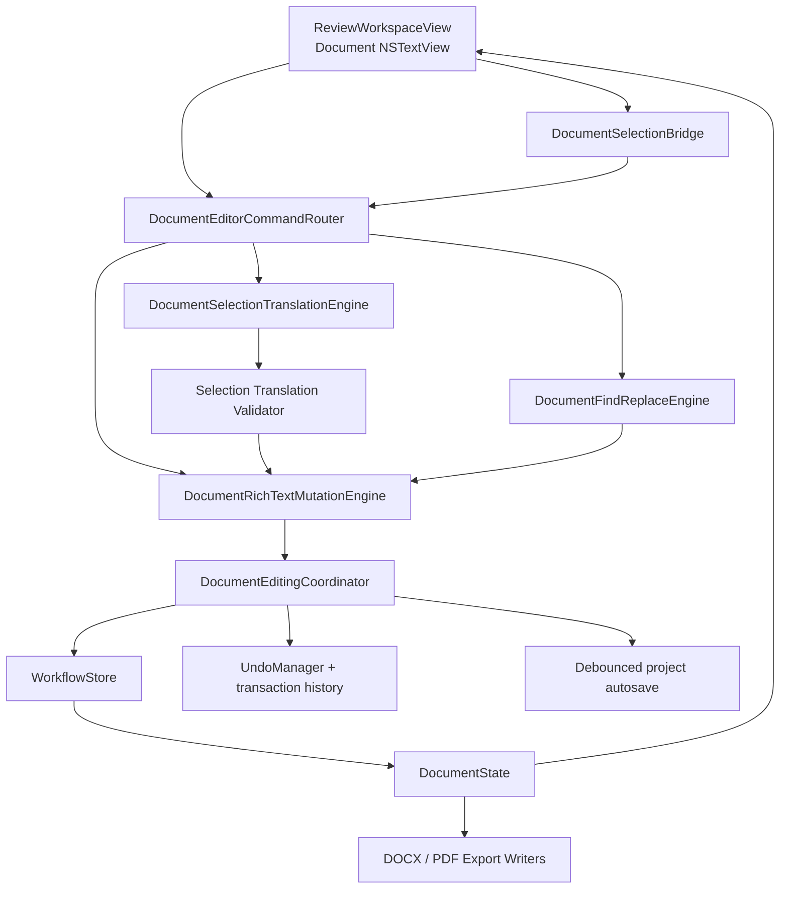
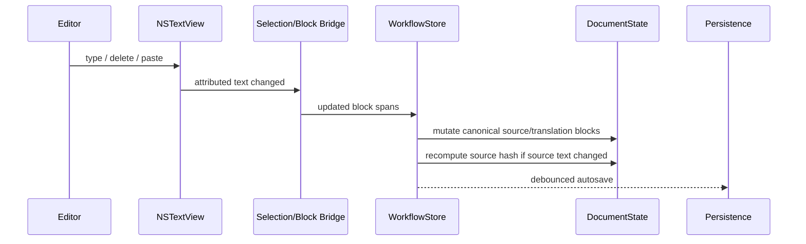
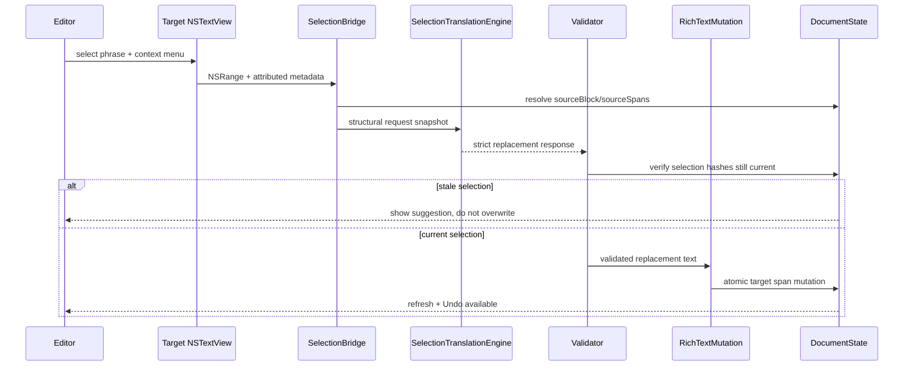
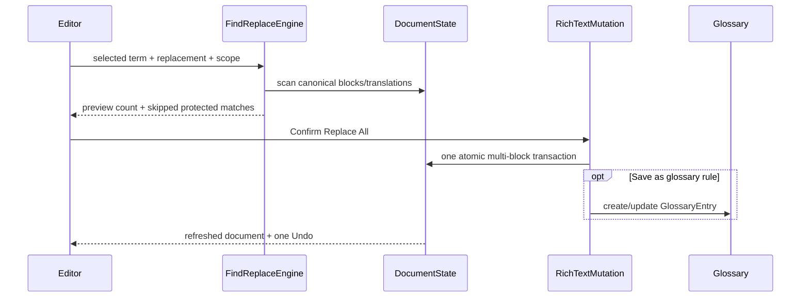

# VaniScript: архитектура полноценного редакторского рабочего места

**Статус:** архитектурная спецификация для последующей декомпозиции Оркестратором  
**Репозиторий:** `Pavan-Gopa/VaniScript`  
**Проверенный commit:** `0747a198e616aa79cf8c54fba87bf5596e379fe4` (`feat: complete Apple Silicon document workflow`)  
**Архитектурная ветка:** `agent/editorial-review-workspace-architecture`  
**Дата анализа:** 15 августа 2026  
**Область этой работы:** архитектурный документ; продуктовый код не изменяется

---

## 1. Короткий вердикт

VaniScript **не нужен новый параллельный текстовый редактор**. На проверенном commit фундамент уже существует: Document Review использует AppKit `NSTextView`, обе колонки редактируемы, текст хранится как `DocumentBlock` / `RichTextSpan`, есть устойчивые block/span ID, `styleKey`, translation policy, inline traits и цвет. Это правильная база.

Новая фича должна превратить существующий Document Review из «просмотра перевода с базовым редактированием» в **editorial workspace** — рабочее место редактора книги, где четыре разных типа изменений:

1. обычный ручной ввод;
2. форматирование;
3. AI-переперевод выделенного фрагмента;
4. массовая замена по документу;

проходят через **один канонический слой rich-text mutations** и в итоге одинаково корректно обновляют `DocumentState`, чанки, review state, автосохранение, Undo и экспорт.

Главная архитектурная мысль:

> **`DocumentState` остаётся единственным источником истины для документа, а `NSTextView` — редакторским представлением. Никакая массовая замена, AI-команда или форматирование не должны править только экранную строку либо только `ChunkData`.**

Это особенно важно для VaniScript: текущая система уже прошла через ошибки, где сериализация редактируемого attributed text могла терять ID, style metadata, policy, traits и цвет. Новая функциональность не должна снова создавать второй путь изменения текста, обходящий эти гарантии.

Целевой результат — ощущение обычного macOS-редактора: курсор, выделение, Cut/Copy/Paste, Undo/Redo, Bold/Italic/Underline, контекстные AI-команды и «Replace Everywhere», но под этим интерфейсом остаётся строгая структурная модель, пригодная для литературного перевода и DOCX round-trip.

---

## 2. Что уже есть на commit `0747a198…`

### 2.1. Редактируемый attributed text уже существует

`ReviewWorkspaceView.swift` уже использует `DocumentAttributedTextView` на базе AppKit:

- `NSTextView.isEditable = true`;
- `isSelectable = true`;
- `isRichText = true`;
- `allowsUndo = true`;
- source и translated panes получают отдельные наборы `DocumentEditorBlockItem`;
- после `textDidChange` attributed text сериализуется обратно в rich-text блоки и передаётся в `WorkflowStore`.

Следовательно, **обычный ввод, курсор, Backspace, выделение, системный clipboard и базовый responder chain уже должны оставаться нативными AppKit-возможностями**. Их не нужно эмулировать SwiftUI-кнопками.

### 2.2. В attributed string уже встроена структурная идентичность документа

Текущий редактор использует приватные атрибуты:

- `VaniScript.BlockID`;
- `VaniScript.SpanID`;
- `VaniScript.StyleKey`;
- `VaniScript.TranslationPolicy`;
- `VaniScript.ExplicitColorHex`;
- `VaniScript.IsBlockSeparator`;
- `VaniScript.InlineTraits`.

Именно они позволяют понять, к какому `DocumentBlock` и `RichTextSpan` относится конкретный диапазон в `NSTextView`.

**Эти metadata нельзя считать декоративными.** Они должны стать основой selection mapping для контекстного меню, AI-операций и массовой замены.

### 2.3. Модель уже знает большую часть требуемого форматирования

`RichTextSpan` уже хранит:

- `text`;
- `styleKey`;
- `traits: Set<InlineTrait>`;
- `translationPolicy`;
- `foregroundColorHex`.

`InlineTrait` уже содержит:

- `bold`;
- `italic`;
- `underline`;
- `strikethrough`;
- `superscript`;
- `subscriptText`;
- `smallCaps`.

Поэтому первый релиз полноценного форматирования **не должен вводить второй набор `isBold/isItalic/...` в View layer**. UI-команды должны изменять существующие traits.

### 2.4. Source и Translation уже сохраняются по-разному, как и должны

`WorkflowStore` имеет отдельные document paths:

- `updateCurrentDocumentSource(...)` изменяет `DocumentState.blocks` и пересчитывает `sourceHash`;
- `updateCurrentDocumentTranslated(...)` изменяет `DocumentState.translationsByLanguage[language][blockID]`.

Это правильная граница. Новая архитектура должна её сохранить.

### 2.5. Уже есть Search & Replace и glossary, но document path нужно отделить

В приложении есть `globalSearchAndReplace(...)`, glossary UI и `GlossaryTextRewriter`.

Однако существующая массовая замена в основном работает через `SessionState.chunks`, cue text и media translation archive. Для литературного документа это опасно: canonical rich text находится в `DocumentState.blocks` и `translationsByLanguage`, а экспорт DOCX/PDF читает именно document IR.

Поэтому новая функция «Replace Everywhere» должна **переиспользовать UX и часть matching policy**, но для `.document` иметь отдельный canonical mutation path.

### 2.6. AI-перевод выделенного текста уже имеет хороший прецедент в media UI

Timed cue editor уже имеет selection-aware context menu и действия вроде inline edit / retranslate / polish selection.

Для документов текущая AI-команда — `retranslateCurrentDocumentChunk()` — по-прежнему работает на уровне целого чанка.

Следовательно, selection-aware document AI — это не новый продуктовый паттерн, а расширение уже принятой концепции на `DocumentState`.

### 2.7. Экспорт rich text поддержан лишь частично

PDF writer уже учитывает bold, italic, underline, strikethrough и цвет.

DOCX writer сохраняет исходные `w:rPr` и умеет накладывать explicit foreground color, но для редакторских команд необходимо сделать editor-owned trait overlay явным. Иначе пользователь может нажать Bold в Review, увидеть жирный текст, а экспортированный DOCX сохранить исходное оформление.

---

## 3. Цели новой фичи

### 3.1. Обязательные цели

1. Сделать source и translated document panes полноценными редактируемыми поверхностями.
2. Сохранить стандартное macOS-поведение: caret, selection, keyboard navigation, Backspace/Delete, Cut/Copy/Paste, Select All, Undo/Redo.
3. Дать форматирование выделения как минимум для существующих `InlineTrait`.
4. Сохранить импортированное оформление и block/span identity после любого ручного редактирования.
5. Дать контекстную команду **Retranslate Selection with AI** в правой колонке.
6. Сопоставлять выделенный перевод с доверенным source context, а не переводить фразу «в вакууме».
7. Не отправлять модели весь чанк, если пользователь выбрал одну фразу.
8. Не разрешать запоздавшему AI-ответу затереть текст, который редактор успел изменить после запуска запроса.
9. Дать **Replace Everywhere…** по всему текущему документу и активному языку.
10. Массовая замена должна сохранять rich-text formatting вокруг совпадений.
11. Массовая замена должна быть одной атомарной операцией и одним Undo.
12. Дать возможность после Replace Everywhere сохранить правило как glossary entry, но не заставлять пользователя делать это.
13. Source edit должен помечать зависимый перевод устаревшим, но **никогда не удалять предыдущий перевод**.
14. Все изменения должны переживать save/reopen и `.vaniscript` round-trip.
15. DOCX/PDF export должен отражать редакторское форматирование.
16. Старые media workflows не должны менять поведение.

### 3.2. Что не нужно превращать в первую версию

Не следует пытаться сразу сделать VaniScript клоном Microsoft Word.

За границами первой редакторской версии можно оставить:

- сложную работу с секциями и колонками;
- плавающие изображения;
- track changes / comments уровня Word;
- collaborative multi-user editing;
- arbitrary paragraph layout designer;
- полноценный styles inspector;
- pixel-perfect page layout editor;
- семантическое char-to-char alignment между языками.

Основная задача — **редактирование текста перевода и исходника**, безопасное inline-formatting, AI revision selected text и массовая терминологическая коррекция.

---

## 4. Неприкосновенные инварианты

### INV-1. `DocumentState` — canonical source of truth

Для document workflow нельзя считать `chunk.original` или `chunk.translated` главным хранилищем.

Они могут оставаться aggregate cache для совместимости UI, но после любой редакторской операции должны перестраиваться из:

- `DocumentState.blocks` для source;
- `DocumentState.translationsByLanguage` для translation.

### INV-2. Block ID никогда не меняется из-за редактирования текста

Пользователь может полностью переписать абзац, но его `DocumentBlock.id` остаётся тем же, пока сам структурный блок не удалён/разделён отдельной структурной операцией.

### INV-3. Неизменённый span сохраняет ID

Нельзя при каждом `textDidChange` генерировать новые UUID для всех spans.

Политика identity:

- неизменённый span → тот же ID;
- replacement внутри одного span → тот же ID;
- split → левый/основной fragment сохраняет ID, дополнительные получают новые ID один раз;
- merge эквивалентных соседних spans → сохраняется ID первого;
- block separators никогда не становятся обычным пользовательским текстом.

### INV-4. AI не авторизует форматирование

LLM может предложить **текст**, но не может произвольно прислать trusted `blockID`, `spanID`, `styleKey`, цвет или translation policy и тем самым изменить структуру документа.

Все formatting metadata при AI replacement происходят из текущего trusted document model.

### INV-5. Source edit не стирает translation

Если редактор исправил оригинал, предыдущий перевод остаётся видимым, но становится `stale / Needs Review`.

### INV-6. Programmatic edit = transaction

AI replace, Replace Everywhere и formatting command должны выполняться атомарно:

- либо весь mutation применён;
- либо модель не меняется;
- один mutation = один Undo step;
- project save выполняется после успешного commit.

### INV-7. Paste не имеет права импортировать чужие VaniScript IDs

При вставке attributed text из clipboard внешние/private metadata очищаются.

Нельзя вставить скопированный `VaniScript.BlockID` из одного блока в другой и создать две визуальные области с одинаковой structural identity.

### INV-8. Оригинальный DOCX остаётся immutable asset

Редактор меняет document IR. Исходный пакет DOCX по-прежнему остаётся неизменяемой основой для round-trip export.

### INV-9. Никакого manuscript text в operational logs

Для AI-selection и Replace Everywhere журналировать можно operation ID, block IDs, hash, длины, provider, validation codes и replacement count, но не полный текст книги и не API credentials.

---

## 5. Целевая архитектура



### 5.1. Почему нужен общий mutation engine

Без общего слоя очень легко получить четыре несовместимых реализации:

- keyboard edit сериализует spans одним способом;
- Bold разбивает spans вторым способом;
- AI replacement заменяет plain `String` третьим;
- Replace All обновляет только `ChunkData` четвёртым.

Это почти гарантированно приводит к расхождению UI, project state и DOCX export.

Поэтому все **программные** редакторские команды должны сводиться к одному набору pure operations над rich-text model.

---

## 6. Selection model: как понять, что именно выделил редактор

AppKit даёт `NSRange` внутри общего `NSTextStorage`, но VaniScript нужен структурный selection.

Предлагаемый контракт:

```swift
public enum DocumentEditorSide: String, Codable, Sendable {
    case source
    case translation
}

public struct DocumentTextFragment: Equatable, Sendable {
    public var blockID: String
    public var spanID: String?
    public var utf16RangeInSpan: NSRange
    public var text: String
    public var styleKey: String
    public var traits: Set<InlineTrait>
    public var translationPolicy: SpanTranslationPolicy
    public var foregroundColorHex: String?
}

public struct DocumentTextSelectionSnapshot: Equatable, Sendable {
    public var operationID: UUID
    public var side: DocumentEditorSide
    public var languageKey: String?
    public var chunkPlanID: String
    public var fragments: [DocumentTextFragment]
    public var selectedText: String
    public var blockHashes: [String: String]
    public var targetRevisionHash: String
}
```

### 6.1. Почему диапазоны должны быть UTF-16

`NSTextView`, `NSRange` и `NSAttributedString` работают в UTF-16 offsets.

Хранить selection как Swift `Character` offset, а затем постоянно преобразовывать его обратно опасно для:

- Bengali;
- Sanskrit diacritics;
- combining marks;
- emoji;
- сложных Unicode grapheme clusters.

На UI boundary selection остаётся UTF-16; core mutation engine преобразует диапазон только в момент применения.

### 6.2. Selection строится по private attributes

`DocumentSelectionBridge` проходит по выделенному attributed range и читает:

- BlockID;
- SpanID;
- styleKey;
- policy;
- traits;
- explicit color.

Таким образом, selection не ищется через `String.range(of:)` по всей книге и не путает одинаковые фразы в разных абзацах.

### 6.3. Multi-block selection

Для обычного formatting и Copy/Paste выделение может пересекать несколько блоков.

Для AI retranslate v1 рекомендуется ограничение:

> AI selected retranslation применяется внутри одного logical `DocumentBlock`.

Если выделение пересекает абзацную границу, меню оставляет обычные formatting/replace команды, а AI пункт либо disabled, либо предлагает «Select text inside one paragraph».

Это сознательная защита от неоднозначного source/target alignment, а не техническая слабость editor-а.

---

## 7. Нативное редактирование текста

### 7.1. Не заменять `NSTextView`

Текущий AppKit editor нужно расширять, а не выбрасывать.

Именно он должен оставаться ответственным за:

- caret;
- selection;
- keyboard navigation;
- Backspace/Delete;
- Cut/Copy/Paste;
- Select All;
- Undo typing;
- input methods;
- Bengali/Indic composition;
- macOS spellchecking, если оно включено.

### 7.2. `DocumentNSTextView` становится command-aware

Subclass получает bridge к `DocumentEditorCommandRouter`.

Пример:

```swift
final class DocumentNSTextView: NSTextView {
    weak var commandDelegate: DocumentEditorCommandDelegate?

    override func menu(for event: NSEvent) -> NSMenu? {
        let menu = super.menu(for: event) ?? NSMenu()
        commandDelegate?.augment(menu: menu, selection: selectedRange())
        return menu
    }
}
```

Ключевой момент — **augment `super.menu`**, а не строить меню полностью с нуля.

Так сохраняются нативные Copy/Paste/Services/Spelling items, а VaniScript добавляет свои команды.

### 7.3. Базовое context menu

После системных пунктов:

**Formatting**

- Bold `⌘B`;
- Italic `⌘I`;
- Underline `⌘U`;
- Strikethrough;
- Superscript;
- Subscript;
- Small Caps;
- Clear Manual Formatting.

**AI**

- `Retranslate Selection with AI…` — translated pane;
- `Translate Selection with AI…` — source pane при наличии безопасного target anchor;
- позднее можно добавить `Polish Selection…`.

**Terminology**

- `Replace “…” Everywhere…`;
- `Add / Update Glossary…`.

Пункты должны динамически включаться только если selection подходит команде.

---

## 8. Rich-text mutation engine

Предлагаемый новый pure-core модуль:

`Sources/VaniScriptCore/DocumentRichTextMutation.swift`

Он не знает ни про SwiftUI, ни про AppKit, ни про сеть.

Основные операции:

```swift
public enum DocumentRichTextMutation {
    static func replace(
        spans: [RichTextSpan],
        range: DocumentSpanRange,
        with replacement: String,
        policy: ReplacementFormattingPolicy
    ) throws -> [RichTextSpan]

    static func toggleTrait(
        spans: [RichTextSpan],
        ranges: [DocumentSpanRange],
        trait: InlineTrait
    ) throws -> [RichTextSpan]

    static func replaceAll(
        spans: [RichTextSpan],
        matches: [DocumentTextMatch],
        replacement: String
    ) throws -> MutationResult

    static func normalize(_ spans: [RichTextSpan]) -> [RichTextSpan]
}
```

### 8.1. Span splitting

Если пользователь выделил середину одного span и нажал Italic:

до:

```text
[span-A plain: "The sacred name is Krishna today"]
```

после:

```text
[span-A plain: "The sacred name is "]
[span-B italic: "Krishna"]
[span-C plain: " today"]
```

Стабильность identity:

- `span-A` сохраняет старый ID;
- новые части получают ID один раз;
- последующие перерисовки эти ID не регенерируют.

### 8.2. Normalization

После mutation соседние spans можно сливать, если совпадают:

- styleKey;
- effective traits;
- translation policy;
- color;
- editor formatting overrides.

Это не даёт документу превратиться в тысячи однобуквенных spans после длительной вычитки.

### 8.3. Отдельные formatting overrides

Существующий `traits` хорошо описывает effective formatting, но редактору нужно различать:

- «этот текст не был bold»;
- «этот текст был bold в исходном стиле, а пользователь **явно выключил** bold».

Для DOCX style inheritance это разные случаи.

Поэтому рекомендуется добавить additive optional metadata:

```swift
public struct EditorInlineOverrides: Codable, Equatable, Sendable {
    public var traitOverrides: [InlineTrait: Bool]
    public var foregroundColorOverride: String?
    public var clearsForegroundColor: Bool
}

extension RichTextSpan {
    public var editorOverrides: EditorInlineOverrides?
}
```

Все поля — optional/decode-if-present, старые `.vaniscript` bundle продолжают открываться.

`Clear Manual Formatting` удаляет overrides и возвращает imported/base style.

---

## 9. Редактирование исходника и freshness перевода

Редактор должен иметь право исправить опечатку в оригинале.

Но source и translation нельзя вести как две независимые строки.

### 9.1. Использовать уже существующий `sourceHash`

`DocumentBlock.sourceHash` меняется после изменения source text.

`TranslatedBlock.sourceHash` уже хранит hash источника, на основании которого был создан перевод.

Следовательно, freshness можно вычислять без нового обязательного состояния:

```swift
enum TranslationFreshness {
    case missing
    case fresh
    case stale
}

fresh = translated.sourceHash == sourceBlock.sourceHash
```

### 9.2. Поведение после source edit

Если изменился **текст** source block:

1. обновить source spans;
2. пересчитать `DocumentBlock.sourceHash`;
3. предыдущий `TranslatedBlock` оставить как есть;
4. его старый `sourceHash` не переписывать автоматически;
5. UI показывает `Source changed — translation needs review`;
6. соответствующий chunk становится `needsReview`, если был ранее approved;
7. export policy может предупредить о stale translated blocks.

Если изменилось только форматирование без изменения source text, текстовый source hash остаётся тем же и translation не становится stale.

### 9.3. Почему нельзя автоматически удалить перевод

Удаление старого перевода при source edit плохо для редактора:

- он теряет полезную работу;
- небольшая опечатка в оригинале может не требовать полного переперевода;
- AI может упасть, а предыдущая версия всё ещё полезна;
- текущая архитектура уже придерживается принципа сохранения previous valid translation при provider failure.

Редактор сам решает, исправить target вручную или запустить AI retranslate.

---

## 10. AI: переперевод только выделенной фразы

Это центральная новая возможность.

### 10.1. Основной UX: действие из translated pane

Надёжный v1 flow:

1. редактор выделяет фразу в правой колонке;
2. правый клик → `Retranslate Selection with AI…`;
3. VaniScript строит structural selection snapshot;
4. по `sourceBlockID` и span IDs находит соответствующий source block/spans;
5. в AI уходит:
   - source context;
   - выбранный target fragment;
   - небольшой target prefix/suffix;
   - target language;
   - glossary/protected terms;
   - operation ID;
6. модель возвращает **только replacement для выделения**;
7. локальный validator проверяет ответ;
8. перед применением VaniScript убеждается, что selection не устарел;
9. пользователь принимает suggestion либо выполняется validated replacement с немедленным Undo.

### 10.2. Не выдумывать char-level alignment между языками

Русская/бенгальская/чешская фраза не обязана иметь тот же character range, что английская.

Поэтому запрещено делать:

```text
30% target paragraph ≈ 30% source paragraph
```

Это семантически ложное сопоставление.

Вместо этого используется **structural alignment**:

1. target block → `sourceBlockID`;
2. target spans по возможности уже имеют IDs доверенных source spans;
3. если выделение касается source-linked spans, в AI передаются именно соответствующие source spans;
4. если точной span связи нет — передаётся весь source block с пометкой `alignment = blockContext`.

Модель получает достаточно контекста, чтобы понять, чему соответствует выделенный target fragment, но VaniScript не притворяется, что знает точный source character offset.

### 10.3. Новый selection contract

Предлагаемые файлы:

- `DocumentSelectionTranslationContracts.swift`;
- `DocumentSelectionTranslationValidator.swift`;
- `DocumentSelectionTranslationEngine.swift`.

Request:

```swift
struct DocumentSelectionTranslationRequest: Codable, Sendable {
    var schema: String
    var operationID: String
    var targetLanguage: String
    var sourceBlockID: String
    var sourceHash: String
    var sourceContext: String
    var selectedTargetText: String
    var targetPrefix: String
    var targetSuffix: String
    var protectedTokens: [String]
    var glossary: [DocumentGlossaryHint]
}
```

Strict response:

```json
{
  "schema": "vaniscript.document.selection.v1",
  "operationId": "...",
  "replacementText": "..."
}
```

Модель не возвращает offsets и IDs, которыми можно напрямую переписать документ.

### 10.4. Provider routing

Для команды нужно использовать **существующий editing/translation provider selection**, а не создавать отдельный список моделей в Review.

`WorkflowStore.editingProviderID` уже соответствует session/workflow translation provider.

Новый engine должен переиспользовать те же cloud/local adapters, budgets, key bank и usage accounting, что и остальные editing operations.

### 10.5. Selection validator

Минимальные проверки:

- schema / operation ID;
- replacement не пустой;
- модель не вернула surrounding target paragraph целиком;
- protected tokens не исчезли;
- placeholders не изменились;
- numbers не были произвольно заменены;
- output не содержит markdown fences / комментариев модели;
- extreme length ratio → warning/preview;
- obvious source-language residue → warning;
- output не идентичен selection, если операция заявлена как retranslate — warning, но не обязательная ошибка.

### 10.6. Stale-response protection

При старте запроса сохраняются:

- block source hash;
- hash текущего target block;
- selected target text;
- structural fragment IDs.

Когда AI отвечает, VaniScript повторно читает current state.

Если пользователь за это время что-то напечатал внутри затронутого target block:

> AI result **не применяется автоматически**.

Вместо этого показывается `Text changed while AI was working — review suggestion`.

Это обязательный gate: сетевой ответ никогда не должен перетирать более новую ручную работу.

### 10.7. Форматирование после AI replacement

LLM возвращает plain replacement text.

Mutation engine применяет trusted formatting policy:

- selection внутри одного effective style → replacement наследует этот style;
- protected/italic style islands внутри selection передаются как protected tokens и восстанавливаются по trusted metadata;
- mixed-format selection, которое нельзя безопасно восстановить, открывает preview и не auto-applies.

Так AI не может сам решить, что весь абзац теперь жирный или поменять `styleKey`.

### 10.8. AI-команда из source pane

Source selection имеет точный source range, но не всегда имеет точный target range.

Поэтому v1 policy:

- если source selection соответствует целым source spans и matching target span IDs однозначны → можно предложить `Translate Selection into Target…`;
- если target anchor неоднозначен → AI suggestion показывается в preview, но **не заменяет автоматически весь translated block**.

Основной быстрый сценарий для редакторов книг остаётся: выделить проблемную фразу справа и выбрать `Retranslate Selection with AI`.

---

## 11. Replace Everywhere: массовая замена по всему документу

### 11.1. UX

Редактор выделяет, например:

`Шрила Прапада`

Context menu:

`Replace “Шрила Прапада” Everywhere…`

Открывается компактный sheet:

```text
Find:       Шрила Прапада
Replace:    Шрила Прабхупада

Scope:      Current translation — Bengali
☑ Whole word
☐ Case sensitive
☑ Skip protected text
☐ Save as glossary rule

Found: 37 occurrences in 24 blocks
Skipped: 1 protected occurrence

[Cancel] [Replace All 37]
```

После подтверждения — один document transaction, один save, один Undo.

### 11.2. Новый canonical service

`DocumentFindReplaceEngine` должен искать **не в aggregate chunk strings**, а непосредственно в document IR.

```swift
struct DocumentTextMatch: Equatable, Sendable {
    var side: DocumentEditorSide
    var languageKey: String?
    var blockID: String
    var spanRanges: [DocumentSpanRange]
    var matchedText: String
    var protectedMatch: Bool
}
```

Search scope:

```swift
enum DocumentSearchScope {
    case currentSourceDocument
    case currentTranslation(languageKey: String)
}
```

Опционально позже:

- current chunk;
- current section/chapter;
- all translations.

Для пользовательской задачи default — **весь текущий документ, текущая колонка/язык**.

### 11.3. Unicode-aware matching

Для имен и терминов нельзя полагаться на ASCII `\b`.

Следует переиспользовать подход `GlossaryTextRewriter`:

```regex
(?<![\p{L}\p{N}_])TERM(?![\p{L}\p{N}_])
```

Это лучше работает с Bengali, Devanagari, диакритикой и европейскими языками.

### 11.4. Rich-text-safe replacement

Matches применяются внутри каждого block **с конца к началу**, чтобы offsets ранних совпадений не сдвигались.

Политика formatting:

- replacement внутри одного span наследует его style/traits/color;
- replacement на границе нескольких одинаковых styles безопасно объединяется;
- mixed-style match не должен молча превращаться в plain text;
- protected span пропускается по умолчанию;
- итоговые spans проходят normalization.

### 11.5. Source Replace Everywhere

Если массовая замена выполняется слева:

1. изменяются `DocumentState.blocks`;
2. пересчитываются source hashes;
3. translations не удаляются;
4. touched translated blocks становятся stale по hash mismatch;
5. affected chunks получают `needsReview`.

### 11.6. Translation Replace Everywhere

Если массовая замена выполняется справа:

1. изменяются `TranslatedBlock.spans` и `.text` активного языка;
2. source block не меняется;
3. перевод сохраняет sourceHash;
4. если block уже был manually/auto approved, deliberate human replacement рекомендуется считать ручной редакторской правкой: block становится `manuallyApproved`;
5. если block ещё не был approved, одна замена не должна автоматически approve весь абзац — disposition остаётся pending/needsReview.

---

## 12. Мини-глоссарий «на лету»

Пользовательская команда «заменить везде» и глобальный glossary — связанные, но **не одинаковые** вещи.

### 12.1. Не сохранять каждую замену в AppSettings автоматически

Одноразовая коррекция может быть специфична для конкретной книги.

Поэтому `Replace Everywhere` сначала является document transaction.

В sheet есть отдельный флажок:

`Save as glossary rule`

### 12.2. Если пользователь хочет сохранить правило

После успешной замены можно создать/обновить `GlossaryEntry`:

- `source` — сопоставленный исходный термин, если он надёжно известен;
- `translation` — новая корректная форма;
- `variants` — неправильная/старая форма;
- `translations[activeLanguage]` — новая форма;
- `remember = true`.

Если source mapping не удалось определить однозначно, UI не должен выдумывать source term. Тогда можно:

- сохранить только document replacement;
- предложить `Open Glossary…` и дать пользователю заполнить rule вручную.

### 12.3. Почему это лучше текущего glossary apply path

Текущий glossary engine хорошо подходит для plain text/cues.

Для documents application должен идти через тот же rich-text mutation engine, что и Replace Everywhere. Тогда glossary application не сможет потерять курсив или split spans.

---

## 13. Clipboard и Paste

### 13.1. Системный clipboard оставить нативным

Пользователь должен иметь привычные:

- `⌘C`;
- `⌘X`;
- `⌘V`;
- drag selection, если AppKit это позволяет;
- plain/rich clipboard из других приложений.

### 13.2. Санитизация внешнего attributed paste

При вставке нельзя принимать чужие private attributes:

- `VaniScript.BlockID`;
- `VaniScript.SpanID`;
- `VaniScript.TranslationPolicy`;
- любые internal markers.

Допустимая стратегия:

1. взять pasteboard attributed/plain string;
2. сохранить только user-visible поддерживаемые traits;
3. назначить destination block identity из caret position;
4. создать новые span IDs только для реально новых fragments;
5. не переносить source/translation policy из чужого документа.

Даже internal copy/paste внутри VaniScript не должен дублировать structural IDs в новом месте.

---

## 14. Undo / Redo и транзакции

### 14.1. Typing Undo

Нативный `NSTextView` уже умеет grouping typing edits.

После undo/redo delegate снова сериализует resulting attributed content в canonical model.

### 14.2. Programmatic Undo

Для:

- Bold/Italic command;
- AI replacement;
- Replace Everywhere;
- glossary application;

создаётся `DocumentEditTransaction`:

```swift
struct DocumentEditTransaction: Sendable {
    var id: UUID
    var reason: DocumentEditReason
    var before: [DocumentBlockPatch]
    var after: [DocumentBlockPatch]
}
```

Coordinator регистрирует inverse transaction в `UndoManager`.

Replace 37 occurrences = **один Undo**, а не 37 шагов.

### 14.3. Undo должен менять model, а не только NSTextStorage

Если undo визуально вернул слово, но `DocumentState` остался после Replace All, экспорт снова выдаст заменённую версию.

Поэтому programmatic undo обязан проходить через canonical mutation coordinator.

---

## 15. Autosave без сохранения проекта на каждый символ

Сейчас document edit path способен вызывать project save очень часто.

Для полноценной вычитки книги лучше разделить:

- **in-memory model commit** — немедленно;
- **disk persistence** — debounce примерно 300–500 ms.

Обязательный flush:

- при смене чанка;
- при потере editor focus;
- перед export;
- перед переключением проекта;
- перед закрытием окна/app termination;
- после AI / Replace Everywhere transaction.

Так пользователь получает обычную отзывчивость редактора, но проект остаётся практически непрерывно сохранённым.

---

## 16. Export fidelity

Редакторская функция считается законченной только если результат виден в export.

### 16.1. PDF

Текущий PDF path уже поддерживает:

- bold;
- italic;
- underline;
- strikethrough;
- foreground color.

Нужно добавить/проверить:

- superscript;
- subscript;
- small caps;
- mixed runs после user edits.

### 16.2. DOCX

Нужен явный `EditorRunPropertyOverlay` поверх trusted source `w:rPr`.

Mapping:

| VaniScript | OOXML |
|---|---|
| bold | `w:b` |
| italic | `w:i` |
| underline | `w:u` |
| strikethrough | `w:strike` |
| superscript | `w:vertAlign val="superscript"` |
| subscript | `w:vertAlign val="subscript"` |
| smallCaps | `w:smallCaps` |
| foreground color | `w:color` |

Важно поддержать **явное выключение** imported/inherited trait.

Например, если исходный style даёт bold, а пользователь снял Bold, writer должен уметь добавить `w:b w:val="0"`, а не просто «не добавить новый `w:b`».

Именно для этого нужны editor overrides, а не только effective trait set.

### 16.3. TXT / Markdown

TXT остаётся plain text.

Не следует молча менять существующий Markdown export contract в рамках этой фичи. Поддержку семантического Markdown bold/italic можно сделать отдельным расширением.

---

## 17. Предлагаемые новые файлы

### VaniScriptCore

```text
Sources/VaniScriptCore/
  DocumentEditingModels.swift
  DocumentRichTextMutation.swift
  DocumentFindReplaceEngine.swift
  DocumentSelectionTranslationContracts.swift
  DocumentSelectionTranslationValidator.swift
  DocumentTranslationFreshness.swift
```

### App / Services

```text
Sources/VaniScript/Services/
  DocumentSelectionTranslationEngine.swift
  DocumentEditingCoordinator.swift
```

### Existing files to modify

```text
Sources/VaniScript/Views/ReviewWorkspaceView.swift
Sources/VaniScript/Stores/WorkflowStore.swift
Sources/VaniScript/Services/DocumentExportWriters.swift
Sources/VaniScriptCore/DocumentModels.swift
Sources/VaniScriptCore/DefaultPrompts.swift
```

Возможно, после реализации станет полезно вынести `DocumentAttributedTextView` из большого `ReviewWorkspaceView.swift` в отдельный файл, но это рефакторинг для читаемости, а не обязательное условие фичи.

---

## 18. Изменения существующих компонентов

### 18.1. `ReviewWorkspaceView.swift`

Добавить:

- selection bridge;
- document context menu augmentation;
- formatting commands;
- AI selection action;
- Replace Everywhere sheet;
- stale source/translation indicator;
- optional AI diff/preview popover.

Не дублировать editor для source/translation — один component, параметризованный `side`.

### 18.2. `WorkflowStore.swift`

Добавить document-specific orchestration methods:

```swift
func applyDocumentFormatting(...)
func replaceDocumentSelection(...)
func replaceEverywhereInDocument(...)
func retranslateDocumentSelection(...)
func undoDocumentTransaction(...)
```

Текущий `globalSearchAndReplace` для media оставить.

Для `sourceKind == .document` UI должен вызывать новый document service, а не plain chunk replacement.

### 18.3. `DocumentModels.swift`

Минимальное additive расширение для explicit editor formatting overrides.

Никаких breaking required fields.

### 18.4. `DefaultPrompts.swift`

Добавить отдельный prompt для selected literary revision.

Он должен прямо запрещать:

- переписывать весь абзац;
- добавлять комментарии;
- возвращать surrounding context;
- сокращать/дописывать смысл;
- менять protected names/terms без необходимости.

### 18.5. `DocumentExportWriters.swift`

Добавить deterministic trait overlay и тесты OOXML для ручного форматирования.

---

## 19. Поток данных: ручной ввод



---

## 20. Поток данных: AI selected retranslation



---

## 21. Поток данных: Replace Everywhere



---

## 22. Форматирование: что включить в первый production slice

### Обязательно

- Bold;
- Italic;
- Underline;
- Strikethrough;
- Superscript;
- Subscript;
- Small Caps;
- Clear Manual Formatting;
- текущий foreground color сохранить end-to-end.

### Следующим расширением

- arbitrary font family;
- font size;
- highlight/background color;
- paragraph alignment;
- indentation;
- list controls.

Эти функции требуют более широкой модели OOXML style overrides и должны быть добавлены без разрушения текущего `styleKey`-based round-trip.

---

## 23. Поведение approval/review state

### Translation manual edit

Если пользователь вручную изменил уже approved translation block:

- это осознанное действие редактора;
- итоговый touched block считается `manuallyApproved`.

Если block до правки был pending/needsReview:

- одиночная правка не должна автоматически подтверждать весь block;
- состояние остаётся pending/needsReview до обычного approve action.

### AI selected replacement

AI сам по себе не является человеческим approval.

Если block был approved и редактор явно нажал `Apply` на AI suggestion, можно оставить/перевести в `manuallyApproved`.

Если block не был approved, применение AI suggestion не auto-approves весь block.

### Source edit

Любое meaningful source text change делает зависимый перевод stale/needsReview независимо от прежнего approval.

---

## 24. Ошибки и failure semantics

### AI provider failure

- selection не меняется;
- предыдущий target text остаётся;
- отображается ошибка;
- retry не требует восстанавливать состояние.

### AI validation failure

- replacement не применяется;
- можно показать provider output только в diagnostic preview без изменения документа;
- manuscript text не пишется в logs.

### Replace Everywhere partial failure

Не допускается режим «17 заменили, на 18-й упали, остальное неизвестно».

Сначала строится полный mutation plan, потом он применяется атомарно.

### Save failure

In-memory document остаётся изменённым, UI показывает persistent save error и предлагает retry. Нельзя откатывать пользовательский ввод только из-за временной disk ошибки.

---

## 25. Performance

Для книги порядка десятков тысяч слов document-wide find/replace должен быть дешёвым в памяти.

Правила:

- regex компилировать один раз на operation;
- не пересобирать весь `DocumentState` после каждого occurrence;
- один проход по relevant blocks;
- mutations внутри block применять от последнего range к первому;
- один final normalization;
- один project save.

Typing path не должен сериализовать/перезаписывать все 800+ paragraphs при каждом символе — только touched blocks.

---

## 26. Тестовая стратегия

Эта фича должна прийти с отдельным большим regression layer.

### 26.1. Rich-text mutation tests

- replace inside one span;
- replace at beginning/end;
- replacement across identical adjacent spans;
- formatting selection split into 3 spans;
- repeated toggle does not churn IDs;
- normalization merges equivalent spans;
- protected span stays untouched;
- Bengali / Devanagari / combining marks;
- selection at surrogate-pair boundaries;
- color survives mutation;
- styleKey survives mutation;
- translationPolicy survives mutation.

### 26.2. Formatting tests

- Bold on/off;
- Italic on/off;
- Underline;
- Strike;
- Superscript/Subscript mutual exclusion;
- Small Caps;
- clear overrides restores imported formatting;
- formatting across multiple spans;
- formatting across block boundary never formats separators.

### 26.3. Clipboard tests

- external plain paste;
- external rich paste;
- internal paste strips duplicated BlockID;
- SpanID collision impossible;
- unsupported attributed keys removed;
- destination policy remains trusted.

### 26.4. Source freshness tests

- source typo changes sourceHash;
- old translation remains intact;
- stale detected;
- chunk becomes needsReview;
- formatting-only source edit does not mark translation stale;
- retranslating stale block restores matching hash.

### 26.5. AI selection tests

- request contains selected target, not whole target chunk;
- request contains mapped source context;
- provider failure preserves original selection;
- invalid schema rejected;
- operationID mismatch rejected;
- protected term removal rejected;
- stale response cannot overwrite newer typing;
- same phrase in two blocks modifies only selected block;
- mixed-format replacement uses trusted formatting;
- AI command disabled for unsafe cross-block selection.

### 26.6. Replace Everywhere tests

- all chunks updated through `DocumentState`;
- current and non-current chunks updated;
- active language only;
- source replacement stales translations;
- target replacement does not alter source;
- whole-word Unicode matching;
- case-sensitive toggle;
- case-insensitive default;
- protected matches skipped and counted;
- formatting preserved;
- one transaction / one undo;
- one save, not N saves;
- 0-match operation is no-op;
- glossary-save option creates correct variant.

### 26.7. Export tests

DOCX:

- editor-added bold;
- editor-removed inherited bold;
- italic/underline/strike;
- super/subscript;
- small caps;
- explicit color;
- mixed formatting inside paragraph;
- unrelated OOXML package entries unchanged.

PDF:

- visible rich traits match model.

### 26.8. End-to-end editor tests

На macOS/AppKit:

1. open DOCX;
2. edit source;
3. edit translation;
4. format target phrase;
5. Replace Everywhere;
6. AI selected retranslate;
7. Undo AI;
8. Redo;
9. save/reopen project;
10. export DOCX;
11. verify text + run properties.

---

## 27. Предлагаемая декомпозиция реализации

### Slice E1 — Editor command foundation

**Цель:** нативное text editing + selection bridge + formatting command layer.

Работы:

- `DocumentTextSelectionSnapshot`;
- context menu augmentation;
- keyboard shortcuts;
- `DocumentRichTextMutation`;
- span identity normalization;
- tests.

Acceptance:

- source и translation редактируются привычно;
- formatting переживает rerender;
- IDs/style/policy не теряются;
- Undo typing работает.

### Slice E2 — Freshness + transactional mutations

**Цель:** безопасные model edits.

Работы:

- sourceHash freshness policy;
- `DocumentEditingCoordinator`;
- programmatic Undo;
- debounced autosave;
- stale badge;
- project reopen tests.

Acceptance:

- source correction не удаляет translation;
- stale перевод очевиден;
- model и UI не расходятся после Undo/save/reopen.

### Slice E3 — Replace Everywhere

**Цель:** массовая терминологическая правка.

Работы:

- document find/replace engine;
- preview sheet;
- whole-word/case/protected options;
- atomic multi-block mutation;
- optional glossary save.

Acceptance:

- десятки совпадений исправляются по всему документу;
- rich formatting сохраняется;
- один Undo возвращает всё целиком.

### Slice E4 — AI selected retranslation

**Цель:** переперевод только выделенной фразы.

Работы:

- source mapping;
- strict selection contract;
- provider routing;
- validator;
- stale response protection;
- preview/apply UX;
- usage accounting.

Acceptance:

- API получает только необходимый selected operation context;
- весь чанк не заменяется;
- provider failure ничего не стирает;
- параллельный ручной edit невозможно затереть старым AI response.

### Slice E5 — Export fidelity

**Цель:** то, что видит редактор, получает пользователь в DOCX/PDF.

Работы:

- editor trait overrides;
- OOXML property overlay;
- explicit false for inherited formatting;
- PDF remaining traits;
- round-trip fixtures.

### Slice E6 — Hardening / destructive QA

- long manuscript;
- multi-language archive;
- hundreds of replacements;
- Unicode;
- protected Sanskrit;
- rapid typing during AI request;
- save/reopen;
- repeated Undo/Redo;
- export after complex edits;
- old media projects unchanged.

---

## 28. Архитектурные решения, которые нельзя упрощать в реализации

### ADR-E1 — Не делать второй document editor

Использовать текущий AppKit attributed editor.

### ADR-E2 — Не править document через `ChunkData` как canonical path

`ChunkData` для document — aggregate compatibility layer.

### ADR-E3 — Не делать AI selection через поиск выбранной строки во всём тексте

Selection адресуется BlockID/SpanID/range.

### ADR-E4 — Не доверять AI formatting metadata

Formatting остаётся локальным trusted metadata.

### ADR-E5 — Не auto-erase stale translation после source edit

Сохранять предыдущую версию, помечать stale.

### ADR-E6 — Replace All = одна транзакция

Никаких N независимых saves/undo records.

### ADR-E7 — External paste очищает structural metadata

Никаких duplicated IDs через clipboard.

### ADR-E8 — DOCX export обязан отражать editor overrides

Форматирование не может быть «только визуальным».

---

## 29. Definition of Done

Фича считается готовой не тогда, когда в контекстном меню появились пункты, а когда выполнены все условия:

1. Редактор может исправить символ в source и translation обычной клавиатурой.
2. Copy/Paste/Backspace/Undo работают по нормальным macOS conventions.
3. Bold/Italic/etc. переживают смену чанка, save/reopen и DOCX export.
4. Никакая ручная правка не уничтожает BlockID/SpanID/style/policy metadata.
5. Source edit не стирает перевод и делает его stale.
6. Правый клик на target phrase позволяет AI retranslate только selection.
7. AI response не может затереть более новое ручное изменение.
8. Replace Everywhere исправляет весь active document language через `DocumentState`.
9. Replace Everywhere сохраняет rich formatting и protected spans.
10. Одна массовая замена откатывается одним Undo.
11. Опциональная запись в glossary работает отдельно от самой замены.
12. DOCX writer отражает editor-added и editor-removed traits.
13. PDF отражает поддерживаемые rich traits.
14. `.vaniscript` save/reopen восстанавливает edited document без потери metadata.
15. Existing media review/search/glossary/retranslation не регрессируют.
16. Все новые core/editor/export gates покрыты тестами и полный macOS suite зелёный.

---

## 30. Итог

VaniScript уже находится гораздо ближе к профессиональному книжному редактору, чем может показаться по текущему UX. Самая дорогая часть — структурный document IR и rich-text identity — уже присутствует.

Поэтому правильное развитие не в том, чтобы «добавить TextEditor помощнее», а в том, чтобы поставить вокруг существующего `NSTextView` строгую редакторскую архитектуру:

- **Selection Bridge** знает, какой именно structural text выбрал пользователь;
- **Command Router** объединяет native editing, formatting, AI и terminology actions;
- **RichText Mutation Engine** гарантирует, что любой edit сохраняет IDs и formatting metadata;
- **Editing Coordinator** делает mutations атомарными, undoable и autosaved;
- **Selection Translation Engine** перепереводит только выбранный target fragment, используя правильный source context;
- **Find/Replace Engine** исправляет термин по всей книге через canonical `DocumentState`;
- **Export Overlay** гарантирует, что финальный DOCX действительно выглядит так, как его отредактировали.

Это превращает Review из последнего экрана проверки в центральное **editorial workspace** VaniScript — место, где книгу можно не только перевести, но и нормально довести до издательского состояния без перехода в сторонний текстовый редактор на каждом исправлении.
