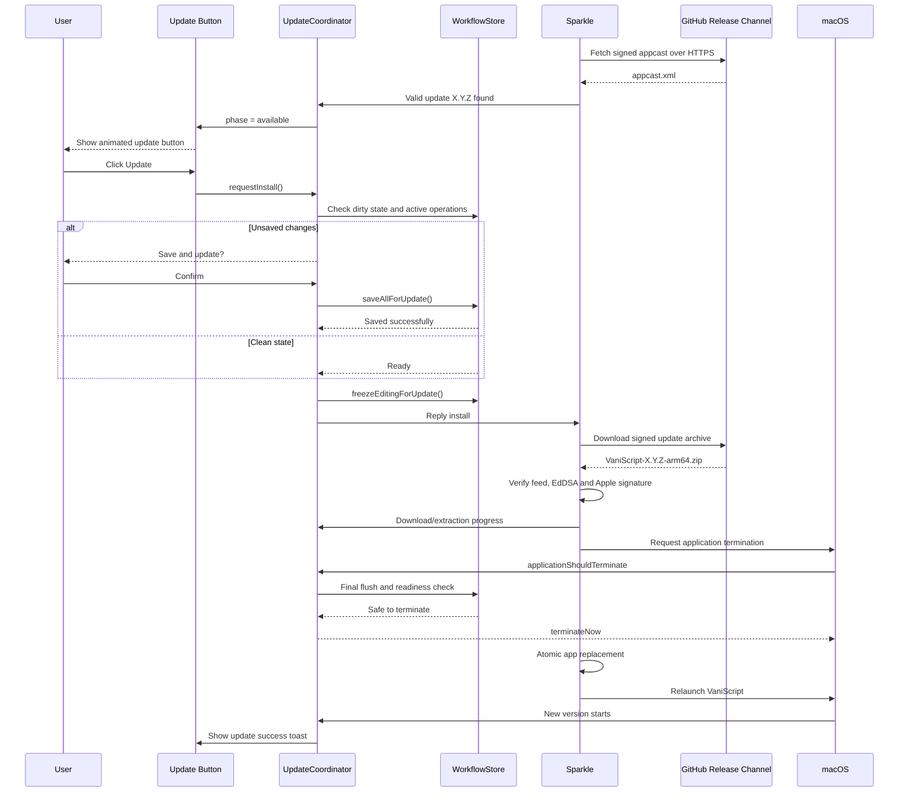

# VaniScript — архитектура обновления по кнопке

> **Статус:** Proposed Architecture  
> **Целевая платформа:** macOS 14+, Apple Silicon (`arm64`)  
> **Канал распространения:** direct distribution, вне Mac App Store  
> **Последнее обновление документа:** 2026-08-18

## 1. Цель

Нужно реализовать не принудительное автообновление, а **обновление по явному действию пользователя**:

1. VaniScript в фоне проверяет наличие новой версии.
2. Если версия доступна, в интерфейсе появляется заметная, но ненавязчивая кнопка `Обновить до X.Y.Z`.
3. Пользователь нажимает кнопку.
4. Приложение проверяет, нет ли несохранённых изменений и незавершённых операций.
5. При необходимости предлагает сохранить проект и не закрывается, пока сохранение не завершилось успешно.
6. Обновление скачивается с GitHub, криптографически проверяется и подготавливается в фоне.
7. VaniScript корректно завершает работу.
8. Подписанный установщик заменяет приложение атомарно.
9. VaniScript автоматически запускается в новой версии.
10. Пользовательские проекты, настройки, локальные модели и ранее выданные разрешения сохраняются настолько, насколько это допускает macOS.

Обновление **никогда не должно** устанавливаться только потому, что новая версия обнаружена. Установка начинается только после нажатия пользователем кнопки.

---

## 2. Архитектурное решение

### 2.1. Основное решение

Для установки обновлений использовать **Sparkle 2**, а не собственный shell-скрипт, который скачивает архив и перезаписывает `.app`.

Sparkle отвечает за:

- загрузку архива обновления;
- проверку EdDSA-подписи архива;
- проверку Apple Code Signing;
- безопасную распаковку;
- атомарную замену приложения;
- работу с правами файловой системы;
- корректное завершение и перезапуск приложения;
- обработку quarantine и App Translocation;
- защиту от частично установленного обновления;
- при необходимости — системный запрос авторизации macOS.

VaniScript отвечает за:

- собственную кнопку обновления;
- анимацию и отображение статуса;
- проверку несохранённых данных;
- сохранение проекта;
- остановку или ожидание активных операций;
- блокировку новых изменений на короткий период установки;
- отображение ошибок и результата обновления.

### 2.2. Почему нельзя делать собственный `curl + unzip + sudo`

Запрещается реализовывать обновление по схеме:

```text
скачать ZIP/DMG → запустить shell → sudo rm -rf старое приложение → скопировать новое
```

Причины:

- приложение не может безопасно заменить само себя во время работы;
- легко получить повреждённую или частично заменённую `.app`;
- самописный скрипт сложнее защитить от подмены архива, path traversal и downgrade-атак;
- нельзя автоматически обходить системную авторизацию macOS;
- пароль администратора нельзя хранить, перехватывать или автоматически подставлять;
- ошибки в скрипте способны удалить рабочую версию приложения или пользовательские файлы;
- сложнее корректно сохранить quarantine, подписи, symlink-структуру фреймворков и executable permissions.

Shell-скрипты допустимы только в доверенном release pipeline для сборки, подписи, notarization и публикации артефактов. На компьютере пользователя установкой управляет подписанный updater framework.

---

## 3. Текущее состояние репозитория и обязательные изменения

### 3.1. Что уже подходит

Текущая архитектура VaniScript хорошо совместима с обновлением заменой `.app`:

- приложение нативное, использует SwiftUI и AppKit;
- целевая архитектура — только `arm64`;
- минимальная версия — macOS 14;
- пользовательские данные находятся вне app bundle, в `~/Library/Application Support/VaniScript`;
- проекты записываются через `ProjectDiskStore` атомарной записью;
- настройки записываются через `SettingsDiskStore` атомарной записью;
- основной bundle identifier уже задан как `com.vaniscript.apple-silicon`;
- release script уже подписывает приложение Developer ID-сертификатом, если сертификат доступен.

Замена `/Applications/VaniScript.app` не должна затрагивать:

```text
~/Library/Application Support/VaniScript/settings.json
~/Library/Application Support/VaniScript/projects.json
~/Library/Application Support/VaniScript/Projects/
~/Library/Application Support/VaniScript/Recordings/
~/Library/Application Support/VaniScript/Imports/
~/Library/Application Support/VaniScript/bin/
```

### 3.2. Текущие блокеры

Перед включением updater необходимо устранить следующие проблемы.

#### Версионирование

В `script/build_release_dmg.sh` сейчас жёстко задано:

```xml
<key>CFBundleShortVersionString</key>
<string>1.0.0</string>
```

Это несовместимо с нормальным release channel. Скрипт должен принимать:

```bash
VANISCRIPT_VERSION=1.4.0
VANISCRIPT_BUILD_NUMBER=10427
```

И записывать:

```xml
<key>CFBundleShortVersionString</key>
<string>1.4.0</string>
<key>CFBundleVersion</key>
<string>10427</string>
```

Требования:

- `CFBundleShortVersionString` — человекочитаемый SemVer;
- `CFBundleVersion` — строго возрастающее числовое значение;
- новая публикация никогда не использует меньший или повторяющийся build number;
- git tag имеет форму `vX.Y.Z`;
- `AppBuildIdentity` должен показывать и semantic version, и build number.

#### Подпись production-сборки

Текущий release script при отсутствии Developer ID переключается на ad-hoc signing:

```bash
SIGN_IDENTITY="-"
```

Для production-релиза это должно быть **фатальной ошибкой**. Ad-hoc signing допускается только в локальной debug-сборке.

Release pipeline обязан завершаться ошибкой, если отсутствуют:

- Developer ID Application certificate;
- закрытый ключ сертификата;
- notarization credentials;
- Sparkle EdDSA private key;
- корректный semantic version;
- строго возрастающий build number.

#### Notarization

Текущий `build_release_dmg.sh` подписывает приложение и DMG, но не выполняет полный notarization workflow.

Нужно добавить:

1. Developer ID signing с Hardened Runtime.
2. `xcrun notarytool submit ... --wait`.
3. `xcrun stapler staple` для приложения и распространяемого DMG, где применимо.
4. `xcrun stapler validate`.
5. `spctl --assess --type execute` для `.app`.
6. `spctl --assess --type open` или эквивалентную проверку DMG.

Неподписанный, ad-hoc signed или не прошедший notarization артефакт не публикуется.

#### Воспроизводимость сборки

Текущий release script зависит от внешних и машинно-специфичных путей:

- `../Shared/VaniScript_Logo.svg`;
- `../Electron/assets`;
- `/Users/pavan/.cache/.../mlx.metallib`;
- произвольный первый `mlx.metallib`, найденный в `~/.cache`.

Release build должен быть детерминированным:

- все обязательные assets должны находиться в репозитории либо скачиваться из закреплённого, проверяемого источника;
- нельзя использовать абсолютный путь `/Users/...`;
- нельзя брать «первый найденный» файл из пользовательского cache;
- версия и checksum каждого внешнего binary asset должны быть закреплены;
- если обязательный asset отсутствует, release build должен завершиться ошибкой;
- локальная среда разработчика не должна незаметно влиять на содержимое релиза.

#### Lifecycle приложения

`AppDelegate` сейчас не перехватывает асинхронное завершение приложения. Для безопасного обновления нужно реализовать:

```swift
func applicationShouldTerminate(
    _ sender: NSApplication
) -> NSApplication.TerminateReply
```

Если требуется сохранить данные асинхронно, метод возвращает `.terminateLater`, а после успешного сохранения вызывает:

```swift
NSApp.reply(toApplicationShouldTerminate: true)
```

При ошибке сохранения или отмене пользователем:

```swift
NSApp.reply(toApplicationShouldTerminate: false)
```

---

## 4. Канал обновлений на GitHub

### 4.1. Критическое ограничение приватного репозитория

`Pavan-Gopa/VaniScript` является приватным репозиторием. Release assets приватного репозитория требуют GitHub-аутентификацию.

Нельзя:

- встраивать Personal Access Token в приложение;
- хранить GitHub App private key в приложении;
- просить каждого конечного пользователя авторизоваться в GitHub;
- использовать долгоживущий общий токен;
- помещать секрет в `Info.plist`, resources, UserDefaults или исходный код.

Любой встроенный токен будет извлечён из `.app` и даст злоумышленнику доступ к репозиторию.

### 4.2. Рекомендуемая схема

Исходный репозиторий остаётся приватным. Создаётся отдельный публичный artifact-only репозиторий, например:

```text
Pavan-Gopa/VaniScript-Releases
```

Он содержит только:

- подписанные ZIP-архивы обновлений;
- подписанные и notarized DMG для первой установки;
- `appcast.xml`;
- Markdown release notes;
- диагностические checksums;
- публичную историю релизов.

Исходный код, signing secrets и приватные данные туда не попадают.

Рекомендуемая публикация:

```text
Private source repo
Pavan-Gopa/VaniScript
        │
        │ protected release workflow
        ▼
Signed + notarized artifacts
        │
        │ short-lived GitHub App token
        ▼
Public artifact repo
Pavan-Gopa/VaniScript-Releases
        ├── GitHub Releases / VaniScript-X.Y.Z-arm64.zip
        ├── GitHub Releases / VaniScript-X.Y.Z.dmg
        ├── GitHub Pages / appcast.xml
        └── GitHub Pages / notes/X.Y.Z.md
```

`SUFeedURL` рекомендуется направить на GitHub Pages:

```text
https://pavan-gopa.github.io/VaniScript-Releases/appcast.xml
```

Архивы обновлений могут скачиваться по HTTPS из GitHub Releases.

### 4.3. Альтернатива

Если бинарники тоже не могут быть публичными, потребуется отдельный backend, который:

- аутентифицирует пользователя;
- выдаёт короткоживущую подписанную ссылку;
- проксирует или перенаправляет загрузку приватного release asset.

Это существенно усложняет UX и противоречит требованию «без дополнительных заморочек». Для текущей задачи рекомендуется публичный artifact-only release repository.

---

## 5. Компоненты приложения

Предлагаемая структура:

```text
Sources/VaniScript/Updates/
├── UpdateCoordinator.swift
├── UpdatePhase.swift
├── UpdateDescriptor.swift
├── SparkleUpdateService.swift
├── VaniScriptUpdateUserDriver.swift
├── UpdateReadinessProviding.swift
├── UpdateTerminationCoordinator.swift
└── UpdateReceiptStore.swift

Sources/VaniScript/Views/
└── UpdateAvailableButton.swift

Sources/VaniScript/Stores/
└── WorkflowStore+UpdateReadiness.swift

Tests/VaniScriptTests/
├── UpdateCoordinatorTests.swift
├── UpdateReadinessTests.swift
├── UpdateUserDriverTests.swift
└── UpdateTerminationTests.swift
```

### 5.1. `UpdateCoordinator`

`@MainActor ObservableObject`, единая точка состояния updater UX.

Пример модели состояния:

```swift
enum UpdatePhase: Equatable {
    case idle
    case checking
    case available(UpdateDescriptor)
    case preparing(UpdateDescriptor)
    case saving(UpdateDescriptor)
    case downloading(UpdateDescriptor, progress: Double?)
    case verifying(UpdateDescriptor)
    case extracting(UpdateDescriptor, progress: Double?)
    case waitingForTermination(UpdateDescriptor)
    case installing(UpdateDescriptor)
    case relaunching(UpdateDescriptor)
    case failed(UpdateFailure)
}
```

Обязанности:

- публиковать наличие обновления;
- хранить version, build, notes URL и размер;
- управлять кнопкой и progress UI;
- запускать preflight;
- запрашивать сохранение;
- блокировать установку при ошибке сохранения;
- передавать Sparkle решение `.install`, `.dismiss` или `.skip`;
- не допускать двух параллельных update cycles;
- сохранять понятную диагностическую ошибку без stack trace в основном UI.

### 5.2. `SparkleUpdateService`

Тонкая обёртка над Sparkle. Она не должна содержать бизнес-логику проектов.

Обязанности:

- создать и запустить `SPUUpdater`;
- использовать custom `SPUUserDriver`;
- инициировать background check;
- инициировать manual check;
- передавать события в `UpdateCoordinator`;
- логировать update cycle через `Logger`;
- не хранить GitHub credentials;
- работать только с заранее настроенным HTTPS appcast URL.

### 5.3. `VaniScriptUpdateUserDriver`

Для точного UX с кнопкой рекомендуется custom implementation `SPUUserDriver`, а не стандартное окно Sparkle.

Когда Sparkle вызывает `showUpdateFound(...)`, driver:

1. Создаёт `UpdateDescriptor`.
2. Передаёт его в `UpdateCoordinator`.
3. Не показывает модальное окно автоматически.
4. Сохраняет ожидающий reply/continuation.
5. Ждёт действия пользователя.

Когда пользователь нажал кнопку и preflight завершён успешно, coordinator возобновляет Sparkle-flow с выбором `.install`.

Driver также преобразует callbacks Sparkle в состояния:

- начало загрузки;
- полученные байты;
- начало проверки;
- распаковка;
- запрос завершения приложения;
- установка;
- ошибка;
- завершение цикла.

### 5.4. `UpdateReadinessProviding`

Updater не должен напрямую знать внутренности `WorkflowStore`.

Контракт:

```swift
@MainActor
protocol UpdateReadinessProviding: AnyObject {
    var hasUnsavedChanges: Bool { get }
    var activeUpdateBlockingOperations: [UpdateBlockingOperation] { get }

    func saveAllForUpdate() async throws
    func cancelOperationsForUpdate() async throws
    func freezeEditingForUpdate()
    func unfreezeEditingAfterUpdateFailure()
}
```

`WorkflowStore` реализует этот контракт в отдельном extension-файле.

### 5.5. `UpdateTerminationCoordinator`

Отвечает за все termination requests, включая запрос от Sparkle.

Он должен различать:

```swift
enum TerminationReason {
    case userQuit
    case systemShutdown
    case softwareUpdate
}
```

При `.softwareUpdate`:

- повторно проверяется dirty state;
- запрещаются новые изменения;
- дожидаются все pending atomic writes;
- закрываются file handles;
- останавливается MCP server;
- корректно освобождаются audio/video resources;
- после успешной подготовки приложение разрешает завершение.

Повторная проверка обязательна: между первым сохранением и фактическим quit пользователь или асинхронная операция теоретически могут изменить состояние.

---

## 6. Модель несохранённых изменений

### 6.1. Нельзя определять dirty state косвенно

Не следует считать проект сохранённым только потому, что:

- `statusMessage` пуст;
- нет открытого sheet;
- последний autosave был недавно;
- активная кнопка Save отсутствует;
- проект уже есть в `projects.json`.

Нужен явный persistence revision contract.

Рекомендуемая модель:

```swift
@Published private(set) var currentRevision: UInt64
@Published private(set) var persistedRevision: UInt64

var hasUnsavedChanges: Bool {
    currentRevision != persistedRevision || pendingSaveTask != nil
}
```

Любая пользовательская мутация, влияющая на сохраняемый проект, увеличивает `currentRevision`.

После успешной атомарной записи:

```swift
persistedRevision = savedRevision
```

### 6.2. `saveAllForUpdate()`

Метод должен:

1. Завершить debounce текущего autosave.
2. Сформировать immutable snapshot состояния.
3. Записать project metadata атомарно.
4. Записать settings, если они изменены.
5. Flush-нуть pending document writes.
6. Дождаться завершения всех write tasks.
7. Проверить, что сохранённая revision совпадает с текущей.
8. При расхождении повторить snapshot/save либо вернуть контролируемую ошибку.

Если запись завершилась ошибкой:

- обновление не начинается;
- приложение не закрывается;
- editing остаётся доступным;
- пользователь видит понятное сообщение и действия `Повторить` / `Отмена`.

### 6.3. Диалог при несохранённых изменениях

Основной сценарий:

```text
Есть несохранённые изменения

Перед обновлением VaniScript сохранит текущий проект.

[Отмена] [Сохранить и обновить]
```

Не рекомендуется делать `Обновить без сохранения` основной кнопкой. Если такой вариант понадобится, он должен быть вторичным, явно destructive и появляться только после отдельного продуктового решения.

### 6.4. Активные операции

Обновление нельзя начинать посреди:

- записи микрофона;
- записи системного аудио;
- транскрибации;
- перевода;
- экспорта;
- video render;
- загрузки модели;
- установки model package;
- импорта большого документа;
- операции, изменяющей проект на диске.

Для каждой операции должна быть указана стратегия:

| Операция | Стратегия |
|---|---|
| Запись аудио | Остановить, финализировать файл, сохранить проект |
| Транскрибация/перевод | Предложить дождаться или безопасно отменить |
| Экспорт/render | Предложить дождаться или отменить с cleanup temp files |
| Загрузка модели | Можно отменить и продолжить после перезапуска |
| Атомарная запись | Всегда дождаться завершения |
| Import/migration | Блокировать обновление до безопасной точки |

---

## 7. Пользовательский сценарий

### 7.1. Обнаружение обновления

Рекомендуемые настройки:

```xml
<key>SUEnableAutomaticChecks</key>
<true/>
<key>SUScheduledCheckInterval</key>
<real>3600</real>
<key>SUAutomaticallyUpdate</key>
<false/>
<key>SUAllowsAutomaticUpdates</key>
<false/>
<key>SUEnableSystemProfiling</key>
<false/>
```

Это означает:

- проверка выполняется автоматически;
- минимальный интервал — один час;
- обновление не устанавливается автоматически;
- пользователь не может случайно включить полностью автоматическую установку;
- системный профиль не отправляется.

На старте приложения допустима одна background-проверка сразу после запуска updater, если automatic checks включены. После этого расписанием управляет Sparkle. Не следует вручную запускать проверку при каждом `didBecomeActive`, чтобы не ломать scheduler и не создавать лишний трафик.

Кнопка не может появиться буквально в ту же секунду, когда опубликован релиз, если приложение спит, offline или ещё не выполнило следующую проверку. Целевой SLA:

- сразу после ручного `Check for Updates…`;
- при следующем запуске приложения;
- не позднее одного scheduled interval при работающем приложении и доступной сети.

### 7.2. Размещение кнопки

В `ContentView` кнопку рекомендуется разместить в правом верхнем toolbar-блоке перед кнопками AI Assistant / Help / Projects / Settings.

Состояние `available`:

```text
[ ↓  Обновить до 1.4.0 ]
```

Кнопка должна:

- показываться только для версии новее текущей;
- содержать version number;
- иметь tooltip;
- иметь accessibility label;
- поддерживать keyboard focus;
- не перекрывать существующие onboarding targets;
- исчезать после skip или успешной установки;
- превращаться в progress control после нажатия.

### 7.3. Анимация «волны»

Рекомендуемый эффект:

- мягкий shimmer/волна проходит по border или background;
- длительность одного прохода около 1.2–1.8 секунды;
- после 2–3 проходов эффект останавливается или переходит в редкий спокойный pulse;
- анимация не должна бесконечно отвлекать;
- при `accessibilityReduceMotion == true` shimmer отключается и заменяется статическим accent border;
- progress state не использует декоративную волну.

### 7.4. Нажатие на кнопку

#### Если проект чистый

1. Кнопка меняется на `Подготовка…`.
2. Проверяются активные операции.
3. Editing временно блокируется.
4. Sparkle получает `.install`.
5. Начинается загрузка.

#### Если проект грязный

1. Показывается диалог сохранения.
2. Пользователь выбирает `Сохранить и обновить`.
3. Выполняется `saveAllForUpdate()`.
4. Только после успешного сохранения начинается загрузка.

#### Если сохранение не удалось

1. Приложение остаётся открытым.
2. Update cycle не получает `.install`.
3. Editing разблокируется.
4. Показывается ошибка и кнопка retry.

### 7.5. Загрузка и установка

Во время загрузки приложение остаётся открытым.

Кнопка последовательно показывает:

```text
Скачивание 28%
Проверка подписи…
Распаковка…
Подготовка к перезапуску…
```

После проверки:

1. Sparkle запрашивает завершение приложения.
2. `UpdateTerminationCoordinator` повторно проверяет readiness.
3. VaniScript закрывается.
4. Sparkle атомарно заменяет `.app`.
5. Новая версия запускается автоматически.

После перезапуска показывается ненавязчивый toast:

```text
VaniScript обновлён до версии 1.4.0
```

---

## 8. Sequence diagram



---

## 9. Сохранение разрешений macOS

### 9.1. Что реально сохраняет разрешения

macOS не «копирует разрешения из старой версии скриптом». TCC связывает разрешения с идентичностью подписанного кода.

Чтобы микрофон, Apple Events и другие разрешения продолжили действовать, релизы должны сохранять:

1. Один и тот же `CFBundleIdentifier`:

   ```text
   com.vaniscript.apple-silicon
   ```

2. Один и тот же Developer ID Team ID.
3. Совместимый designated requirement.
4. Один и тот же тип distribution signing.
5. Совместимый набор entitlements.
6. То же назначение приложения, а не новый bundle с другим identifier.

Текущий сертификат в release script:

```text
Developer ID Application: Stichting Kadamba Foundation (438UQRF7JV)
```

Production updates должны продолжать подписываться совместимой Developer ID identity этой команды либо должна быть заранее спроектирована контролируемая миграция identity.

### 9.2. Важное ограничение

Нельзя гарантировать отсутствие повторного системного запроса во всех случаях.

Повторный prompt возможен, если:

- предыдущая версия была ad-hoc signed;
- изменилась signing team;
- изменился bundle identifier;
- designated requirement стал несовместимым;
- entitlement изменился существенным образом;
- macOS сбросила или пересмотрела разрешение;
- разрешение Apple Events относится к новому target application;
- пользователь сам отозвал разрешение.

Особенно важно протестировать переход от уже распространённых ad-hoc builds к первой стабильной Developer ID signed версии. На этом переходе часть разрешений может быть запрошена повторно. После закрепления стабильной identity последующие обновления должны наследовать TCC-идентичность штатно.

### 9.3. Запрещённые способы

Нельзя:

- изменять TCC database;
- запускать `tccutil` для скрытого восстановления разрешений;
- копировать системные privacy databases;
- просить Full Disk Access только ради updater;
- подделывать code requirement;
- подавлять системные prompts приватными API.

---

## 10. Info.plist и Sparkle security settings

Для direct-distribution build:

```xml
<key>SUFeedURL</key>
<string>https://pavan-gopa.github.io/VaniScript-Releases/appcast.xml</string>

<key>SUPublicEDKey</key>
<string>BASE64_PUBLIC_ED25519_KEY</string>

<key>SUEnableAutomaticChecks</key>
<true/>

<key>SUScheduledCheckInterval</key>
<real>3600</real>

<key>SUAutomaticallyUpdate</key>
<false/>

<key>SUAllowsAutomaticUpdates</key>
<false/>

<key>SUVerifyUpdateBeforeExtraction</key>
<true/>

<key>SURequireSignedFeed</key>
<true/>

<key>SUEnableSystemProfiling</key>
<false/>

<key>SUEnableJavaScript</key>
<false/>
```

Примечания:

- `SURequireSignedFeed` требует совместимую современную версию Sparkle 2;
- начальный кандидат — закреплённая reviewed stable версия Sparkle `2.9.4`; перед merge версия повторно проверяется;
- dependency должна быть pinned, а не указывать на branch `main`;
- public key хранится в приложении;
- private EdDSA key никогда не попадает в приложение или git;
- checksum-файл полезен для диагностики, но не заменяет EdDSA и Apple Code Signing;
- приложение сейчас не имеет `com.apple.security.app-sandbox`, поэтому sandbox-only Sparkle XPC settings включать не следует без отдельного перехода на sandbox.

Для возможной Mac App Store сборки Sparkle и direct updater должны быть полностью исключены compile-time флагом. App Store build не должен скачивать и устанавливать новый executable code вне Store.

---

## 11. Интеграция Sparkle в Swift Package Manager и custom bundle script

### 11.1. `Package.swift`

Добавить pinned dependency:

```swift
.package(
    url: "https://github.com/sparkle-project/Sparkle",
    exact: "2.9.4"
)
```

И product dependency для executable target:

```swift
.product(name: "Sparkle", package: "Sparkle")
```

### 11.2. Особенность текущего build process

VaniScript собирает app bundle вручную через `swift build`, а не стандартным Xcode archive target. Поэтому одного изменения `Package.swift` недостаточно.

Release script должен:

1. Найти собранный `Sparkle.framework`.
2. Скопировать его в:

   ```text
   VaniScript.app/Contents/Frameworks/Sparkle.framework
   ```

3. Сохранить symlinks и executable permissions.
4. Проверить `otool -L` для `VaniScript` binary.
5. Убедиться, что runtime search path содержит:

   ```text
   @executable_path/../Frameworks
   ```

6. Подписать nested code в правильном порядке.
7. Проверить весь bundle после подписи.

Для копирования framework предпочтительно использовать `ditto`, а не операции, способные разыменовать symlinks.

### 11.3. Release archive

Для обновлений рекомендуется отдельный ZIP:

```bash
ditto -c -k --sequesterRsrc --keepParent \
  VaniScript.app \
  VaniScript-1.4.0-arm64.zip
```

ZIP быстрее и проще для updater, чем монтирование DMG. DMG сохраняется для первой ручной установки.

---

## 12. Release pipeline

### 12.1. Новый workflow

Создать:

```text
.github/workflows/release.yml
```

Trigger:

- protected tag `vX.Y.Z`; либо
- manual `workflow_dispatch` с version и build number;
- protected GitHub Environment `production-release` с manual approval.

### 12.2. Секреты

В protected release environment:

- Developer ID certificate в зашифрованном виде;
- certificate password;
- notarization key / App Store Connect API key;
- Sparkle EdDSA private key;
- GitHub App credentials или другой механизм выпуска короткоживущего token для `VaniScript-Releases`.

Предпочтение: short-lived GitHub App installation token, а не долгоживущий PAT.

### 12.3. Этапы workflow

1. Checkout точного protected tag.
2. Проверка чистоты и соответствия version tag.
3. Проверка, что build number больше последнего опубликованного.
4. `swift test`.
5. Запуск обязательного QA gate.
6. Детерминированная release build для `arm64`.
7. Встраивание Sparkle framework и runtime assets.
8. Подпись nested binaries inside-out.
9. Подпись `.app` Developer ID Application.
10. `codesign --verify --deep --strict --verbose=2`.
11. Создание update ZIP через `ditto`.
12. Создание DMG для первичной установки.
13. Notarization.
14. Stapling и validation.
15. `spctl` assessment.
16. Генерация release notes.
17. Генерация подписанного `appcast.xml` через Sparkle `generate_appcast`.
18. Загрузка ZIP и DMG в GitHub Release artifact repo.
19. Проверка, что опубликованный asset скачивается и checksum совпадает.
20. Публикация release notes.
21. **Публикация appcast последней операцией**.
22. Smoke update test с предыдущей production-версии.

Публикация appcast последней предотвращает ситуацию, когда клиент видит обновление, но архив ещё не загружен.

### 12.4. Артефакты релиза

```text
VaniScript-X.Y.Z-arm64.zip
VaniScript-X.Y.Z.dmg
VaniScript-X.Y.Z.md
appcast.xml
checksums.txt
```

Отдельно, не обязательно публично:

```text
VaniScript-X.Y.Z.dSYM.zip
build-manifest.json
SBOM
notarization-log.json
```

### 12.5. Signing policy

Release workflow обязан проверять:

```text
Bundle ID              == com.vaniscript.apple-silicon
Architecture           == arm64
Minimum macOS          == 14.0
Developer Team         == expected Team ID
Hardened Runtime       == enabled
Notarization           == accepted
Sparkle archive sig    == valid
Signed appcast         == valid
```

---

## 13. Защита данных и миграции

### 13.1. Данные не хранятся в `.app`

Ни проект, ни настройки, ни model state не должны записываться внутрь:

```text
/Applications/VaniScript.app
```

App bundle считается read-only immutable code.

### 13.2. Предобновительный backup

Перед первой установкой каждой новой версии рекомендуется создать небольшой metadata backup:

```text
~/Library/Application Support/VaniScript/Updates/Backups/
└── 1.3.0-to-1.4.0/
    ├── settings.json
    ├── projects.json
    └── receipt.json
```

Не нужно копировать крупные recordings, local models и media assets на каждое обновление. Они остаются на месте. Backup нужен для small mutable metadata и диагностики.

### 13.3. Schema migrations

Если формат `AppSettings`, `ProjectRecord` или document state меняется:

- у сохраняемого формата должен быть schema version;
- migration выполняется отдельным слоем;
- migration должна быть idempotent;
- сначала создаётся backup;
- затем читается старый формат;
- новый файл записывается атомарно;
- при ошибке исходный файл не удаляется;
- migration покрывается fixtures от нескольких предыдущих production-версий.

### 13.4. Update receipt

После установки сохранить:

```json
{
  "fromVersion": "1.3.0",
  "fromBuild": "10318",
  "toVersion": "1.4.0",
  "toBuild": "10427",
  "installedAt": "2026-08-18T12:00:00Z",
  "status": "launched"
}
```

После успешной инициализации новой версии status меняется на `healthy`.

Это даёт:

- сообщение об успешном обновлении;
- диагностику crash-after-update;
- основу для controlled recovery;
- возможность отличать первый запуск после update от обычного запуска.

---

## 14. Ошибки и восстановление

### 14.1. Ошибка сети

- старая версия продолжает работать;
- проект остаётся открыт;
- кнопка меняется на `Повторить обновление`;
- частичный download удаляется или безопасно возобновляется Sparkle;
- приложение не закрывается.

### 14.2. Недостаточно места

- update не начинается или останавливается до установки;
- пользователь получает требуемый объём свободного места;
- текущая `.app` не меняется.

### 14.3. Неверная подпись

- архив немедленно отклоняется;
- приложение не закрывается;
- ошибка логируется как security failure;
- UI не предлагает «установить всё равно».

### 14.4. Ошибка сохранения

- установка блокируется;
- приложение не закрывается;
- пользователь может повторить сохранение;
- editing разблокируется после отмены update flow.

### 14.5. Ошибка установки

- Sparkle должен сохранить рабочую версию благодаря atomic replacement;
- пользовательские данные не изменяются updater-компонентом;
- показывается понятная recovery-инструкция;
- лог доступен через Console и собственный diagnostic export.

### 14.6. Rollback плохого релиза

Не публиковать downgrade с меньшим build number.

Правильный rollback:

1. Берётся код предыдущей стабильной версии.
2. Исправляются необходимые migration/recovery детали.
3. Выпускается новый semantic patch либо emergency build.
4. Новый build number выше проблемной версии.
5. Публикуется как обычное подписанное обновление.

Предыдущие release assets сохраняются для поддержки и тестирования, но клиент не должен автоматически устанавливать более низкую версию.

---

## 15. Security model

### 15.1. Trust chain

```text
Protected release source/tag
        ↓
Trusted macOS release runner
        ↓
Developer ID code signing
        ↓
Apple notarization
        ↓
Sparkle EdDSA archive signature
        ↓
Signed appcast
        ↓
HTTPS GitHub distribution
        ↓
Sparkle verification on client
        ↓
Atomic installation
```

### 15.2. Защищаемые угрозы

| Угроза | Защита |
|---|---|
| Подмена download по сети | HTTPS + EdDSA archive signature |
| Взлом public release repo | EdDSA + Apple Code Signing |
| Подмена appcast | Signed feed + pinned public key |
| Публикация unsigned build | Release gate fail-closed |
| Downgrade attack | Strictly increasing build number |
| Утечка GitHub token из app | В приложении нет token |
| Частичная замена `.app` | Sparkle atomic installer |
| Потеря проекта при quit | Dirty-state gate + atomic save |
| Компрометация CI secret | Protected environment, least privilege, audit, rotation |
| Выпуск с чужим certificate | Team ID и designated requirement verification |

### 15.3. Signing keys

- Sparkle private key не хранится рядом с публичными release assets.
- Public EdDSA key встраивается в `Info.plist`.
- Private key доступен только protected release job.
- Ротация key должна быть заранее протестирована по официальной процедуре Sparkle.
- Apple certificate и private key не должны быть доступны обычным CI jobs и pull requests.
- Workflow из fork/PR никогда не получает production secrets.

### 15.4. Release notes

- предпочтительно Markdown или plain text;
- JavaScript выключен;
- ссылки только HTTPS;
- release notes не должны интерпретироваться как команды;
- пользовательские данные не включаются в update check URL.

---

## 16. Нормальный сценарий без запроса администратора

Для максимально бесшовной установки первая версия должна быть установлена в стандартное место:

```text
/Applications/VaniScript.app
```

И приложение должно иметь корректные ownership/permissions.

Sparkle самостоятельно определяет, может ли заменить bundle без elevation. Если macOS требует системную авторизацию, её нельзя законно и безопасно обойти.

Требование следует формулировать так:

> При обычной user-owned установке обновление выполняется без дополнительных действий. Если macOS требует administrator authorization из-за ownership или системной политики, показывается штатный системный prompt.

Не обещать абсолютное отсутствие prompts на любой конфигурации Mac.

Если VaniScript запущен из DMG, read-only volume, Downloads под App Translocation или другого неподходящего места:

- updater не должен пытаться самодельно переносить bundle;
- UI объясняет, что приложение нужно один раз переместить в Applications;
- кнопка установки блокируется до корректного размещения.

---

## 17. Test plan

### 17.1. Unit tests

- version/build comparison;
- parsing appcast descriptor;
- переходы `UpdatePhase`;
- duplicate click suppression;
- dirty state true/false;
- successful `saveAllForUpdate()`;
- save failure;
- revision changed during save;
- update blocked by active recording;
- cancel operation then update;
- freeze/unfreeze editing;
- reduced-motion animation path;
- update receipt state transitions;
- error mapping без утечки внутренних деталей.

### 17.2. Integration tests

Использовать локальный HTTPS test feed и тестовую EdDSA keypair.

Сценарии:

1. Valid signed appcast + valid archive.
2. Tampered archive.
3. Wrong EdDSA signature.
4. Signed archive с неверным Apple Team ID.
5. Unsigned feed при `SURequireSignedFeed=true`.
6. Downgrade item.
7. Same build number.
8. Update для неподдерживаемой архитектуры.
9. Update с повышенным minimum macOS.
10. Interrupted download.
11. Low disk space.
12. Redirect chain GitHub Releases.

### 17.3. End-to-end matrix

Минимум:

| Сценарий | Ожидаемый результат |
|---|---|
| Чистый проект | Один клик → download → relaunch |
| Несохранённый проект | Prompt → save → update |
| Save error | Приложение остаётся открытым |
| Пользователь нажал Cancel | Update не начинается |
| Активная запись | Корректная остановка/ожидание |
| Активный render | Wait или safe cancel |
| Нет сети | Retry, без закрытия приложения |
| Повреждённый archive | Reject, без установки |
| App в `/Applications` | Нормальный update path |
| App запущен из DMG | Понятная блокировка |
| User-owned app | Без лишнего prompt |
| Root/admin-owned app | Штатная macOS authorization при необходимости |
| Первая signed migration | Проверка возможных TCC prompts |
| Последующие signed updates | Сохранение разрешений и данных |
| macOS 14 | Полный smoke test |
| Более новые поддерживаемые macOS | Полный smoke test |

### 17.4. Permission regression tests

На чистом тестовом Mac:

1. Установить предыдущую production-версию.
2. Выдать microphone permission.
3. Выдать Apple Events permission в реальном сценарии.
4. Создать проект и изменить настройки.
5. Обновиться через кнопку.
6. Проверить:
   - bundle identifier;
   - Team ID;
   - designated requirement;
   - microphone access;
   - Apple Events access;
   - settings;
   - projects;
   - recordings;
   - local models;
   - MCP configuration;
   - успешный relaunch.

### 17.5. Release gates

Релиз блокируется, если не прошёл хотя бы один gate:

```text
swift test
QA/run_all.sh
arm64 architecture check
codesign verification
Team ID verification
notarization accepted
stapler validation
spctl assessment
Sparkle signature verification
signed appcast verification
clean-machine update smoke test
previous-production → candidate update test
```

---

## 18. Пошаговый план внедрения

### Phase 0 — решения и секреты

- утвердить public artifact repository;
- закрепить Developer ID identity и Team ID;
- создать Sparkle EdDSA keypair;
- определить protected release environment;
- определить version/build number policy;
- зафиксировать direct-distribution scope.

### Phase 1 — воспроизводимая release build

- убрать абсолютные и внешние asset paths;
- параметризовать version/build;
- запретить ad-hoc production fallback;
- добавить notarization/stapling;
- добавить ZIP artifact;
- добавить deterministic manifest и checksums;
- проверить clean-machine build.

### Phase 2 — GitHub release channel

- создать `VaniScript-Releases`;
- настроить GitHub Pages;
- создать protected release workflow;
- добавить загрузку assets через short-lived token;
- генерировать подписанный appcast;
- публиковать appcast последним;
- протестировать feed отдельно от приложения.

### Phase 3 — Sparkle core integration

- добавить pinned Sparkle dependency;
- встроить framework в custom app bundle;
- добавить required rpath;
- реализовать `SparkleUpdateService`;
- реализовать custom `SPUUserDriver`;
- добавить manual `Check for Updates…` command;
- добавить logging и error mapping.

### Phase 4 — безопасное завершение

- добавить explicit dirty-state revision model;
- реализовать `UpdateReadinessProviding`;
- реализовать `saveAllForUpdate()`;
- добавить gating активных операций;
- добавить editing freeze;
- реализовать async termination через `.terminateLater`;
- добавить metadata backup и update receipt.

### Phase 5 — UI

- добавить `UpdateAvailableButton` в `ContentView`;
- добавить shimmer/wave animation;
- поддержать Reduce Motion;
- добавить progress states;
- добавить save prompt;
- добавить retry UI;
- добавить success toast;
- добавить Settings → Updates.

### Phase 6 — тестирование и pilot

- unit/integration/E2E tests;
- tampered update tests;
- clean Mac tests;
- update from previous production build;
- TCC permission regression;
- pilot channel для ограниченной группы;
- phased rollout;
- production rollout после подтверждения telemetry-free diagnostics и support flow.

---

## 19. Рекомендуемая разбивка на pull requests

### PR 1 — Release identity and reproducible packaging

- version/build inputs;
- deterministic assets;
- production signing fail-closed;
- notarization;
- update ZIP;
- build manifest.

### PR 2 — Public release channel and appcast

- release workflow;
- GitHub App token;
- public artifact repo;
- signed appcast;
- publication ordering;
- release documentation.

### PR 3 — Sparkle service layer

- Package.swift;
- framework embedding;
- updater service;
- custom user driver;
- update state model;
- tests.

### PR 4 — Save and termination safety

- dirty-state revisions;
- flush/save contract;
- active operation gating;
- AppDelegate termination handling;
- backup/receipt;
- tests.

### PR 5 — Update button UX

- toolbar button;
- wave animation;
- progress;
- prompts;
- accessibility;
- settings/menu actions;
- snapshot/UI tests.

### PR 6 — E2E release qualification

- previous-version fixtures;
- signed test feed;
- tamper tests;
- permission retention checklist;
- pilot release;
- runbook.

---

## 20. Acceptance criteria

Функция считается готовой, когда выполнены все условия:

1. Новая версия обнаруживается автоматически не позднее scheduled interval при доступной сети.
2. При обнаружении появляется кнопка с номером новой версии.
3. Кнопка имеет аккуратную wave-анимацию и поддерживает Reduce Motion.
4. Без нажатия пользователя установка не начинается.
5. При чистом проекте один клик запускает update flow.
6. При несохранённых изменениях приложение предлагает сохранить проект.
7. При отмене или ошибке сохранения приложение не закрывается.
8. Активная запись, render, export или migration не обрываются неконтролируемо.
9. Архив скачивается только по HTTPS.
10. Appcast и release notes проходят signed-feed validation.
11. Архив проходит EdDSA validation до extraction.
12. Новая `.app` проходит Apple Code Signing validation.
13. Tampered update не может быть установлен.
14. Production release никогда не подписывается ad-hoc.
15. Production release notarized и stapled.
16. В приложении нет GitHub token или другого release credential.
17. После установки VaniScript автоматически перезапускается.
18. Версия после перезапуска соответствует release version/build.
19. `settings.json`, `projects.json`, project directories, recordings и local models сохраняются.
20. При стабильном bundle ID, Team ID и designated requirement разрешения macOS сохраняются в штатном сценарии.
21. Переход от ad-hoc к Developer ID отдельно протестирован и задокументирован.
22. При сетевой, signature или install ошибке предыдущая версия остаётся рабочей.
23. Update smoke test с предыдущей production-версии проходит на чистом Mac.
24. Appcast публикуется только после успешной публикации и проверки assets.
25. Существует runbook для emergency release и rollback-build.

---

## 21. Что не входит в эту задачу

- полностью безусловная silent auto-install;
- принудительное закрытие приложения без согласия пользователя;
- обход administrator authorization;
- изменение TCC database;
- перенос разрешений shell-скриптом;
- хранение GitHub PAT в приложении;
- загрузка executable code из непроверенного URL;
- обновление Mac App Store build через GitHub;
- Windows/Linux updater;
- автоматическое понижение build number;
- переписывание пользовательских данных updater-процессом.

---

## 22. Итоговая архитектура

Итоговый пользовательский путь:

```text
Signed appcast check
        ↓
Update button appears
        ↓
User clicks
        ↓
Dirty-state and active-operation preflight
        ↓
Atomic save and metadata backup
        ↓
Sparkle download from public GitHub release channel
        ↓
Signed feed + EdDSA + Apple signature verification
        ↓
Safe async termination
        ↓
Atomic replacement of VaniScript.app
        ↓
Automatic relaunch
        ↓
Migration/health check
        ↓
“Updated to X.Y.Z”
```

Главный принцип: **VaniScript контролирует пользовательские данные и UX, Sparkle контролирует безопасную установку executable code, GitHub используется только как публичный канал подписанных release artifacts.**

---

## 23. Официальные ссылки

- Sparkle documentation: https://sparkle-project.org/documentation/
- Sparkle programmatic setup: https://sparkle-project.org/documentation/programmatic-setup/
- Sparkle custom user interfaces: https://sparkle-project.org/documentation/custom-user-interfaces/
- Sparkle publishing: https://sparkle-project.org/documentation/publishing/
- Sparkle customization and security keys: https://sparkle-project.org/documentation/customization/
- Apple Developer ID: https://developer.apple.com/support/developer-id/
- Apple code signing designated requirements: https://developer.apple.com/documentation/technotes/tn3127-inside-code-signing-requirements
- Apple notarization troubleshooting: https://developer.apple.com/documentation/security/resolving-common-notarization-issues
- GitHub Releases API authentication: https://docs.github.com/en/rest/releases/releases
